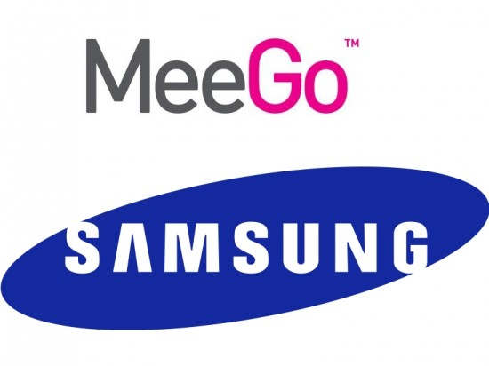

[**أنباء عن رغبة Samsung في شراء نظام MeeGo للاستفادة منه في تطوير نظام Bada**](https://www.it-scoop.com/2011/09/samsung-meego/ )

بعد أن [نفت رغبتها في شراء نظام WebOS](https://www.it-scoop.com/2011/08/hp-touchepad-htc-webos/)، تعود الشائعات من جديد لتضع Samsung في الواجهة، وهذه المرة تدور "الحكاية" حول رغبة المصنِّع الكوري الجنوبي في شراء نظام MeeGo بعد أن فقد النظام أبرز داعميه المتمثل في Nokia التي [قررت الاعتماد على نظام Windows Phone 7](../2011/02/nokia-microsoft-windows-phone-7/).

وبالرغم من [تأكيدها لعدم تخليها عن نظام MeeGo](../2011/02/intel-defends-meego-nokia-defection/) في وقت سابق، إلا أن[ موقع digitimes](http://www.digitimes.com/news/a20110901PD217.html) يشير إلى أن Intel تنوي تجميد تطوير النظام بسبب تراجع الاهتمام به.  في حين يشير [موقع meeGo experts](http://www.meegoexperts.com/2011/09/samsung-meego-superpower-intel/) الذي يستند إلى موقع [netbook news الألماني](http://www.netbooknews.de/49018/intel-gibt-meego-samsung-uebernimmt/) إلى أن Samsung لا تنوي استخدام نظام MeeGo على هواتفها الذكية، وإنما تهدف إلى الحصول على براءات الاختراع الخاصة به والتي تنوي استغلالها لمواصلة تطوير نظامها الخاص [Bada](https://www.it-scoop.com/tag/bada/).

وتركز العديد من الأخبار في الآونة الأخيرة على رغبة كبار مصنعي الهواتف الذكية التي تعتمد على نظام Android في التخلص من تبعيتها لقرارات Google وهذا بعد [شرائها لشركة Motorola Mobility](../2011/08/google-motorola-mobility/)، حيث أُشيع سابقا خبرٌ عن رغبة  Samsung في شراء نظام WebOS قبل أن تنفي Samsung الأمر. [وما لبثت الإشاعات أن انتقلت إلى HTC](https://www.it-scoop.com/2011/08/hp-touchepad-htc-webos/) التي تعتمد هي أيضا على نظام Android في العديد من هواتفها، والتي لا تملك نظاما خاصا بها مثلها هو عليه حال Samsung.
