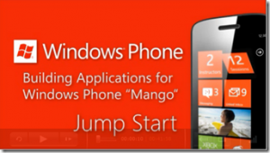

[لم الدّر المنثور من أخبار Microsoft ](https://www.it-scoop.com/2011/09/microsoft-news)

يطل علينا الأخ والكاتب [محمّد فوّاز عرابي](https://www.it-scoop.com/author/muhammad-fawwaz-orabi/) كل أسبوع ب[مختارات من أخبار Google،](https://www.it-scoop.com/2011/09/google-news-4/) ولإضفاء شيء من التوازن والحياد على المجلة التقنية :) أردت أن أضيف شيئا من أخبار Microsoft، وقد رأيت أن هناك من الأخبار ما يصعب أو لا تستحق أن تفرد بموضوع، لكن مع اجتماعها ولمّها، يحصل الخير الكثير، لذا سأحاول أن آخذكم في جولة أتخللها بشيء من التشويق حتى لا تمل الأنفس مما وجدته وتجمّع من أخبار حول الشركة.

**Windows phone 7**

سنبدأ مع الدروس ومحبي الـ Tutorials ، فإن كنت عازما على التطوير لمنصات الهواتف الذكية، فقد تهمك منصة Windows Phone 7 خاصة مع النسخة الجديدة Mango ، ولعل أحد الأسباب للتوجه لهذه المنصة، هو النجاح المتصاعد لـ windows Phone 7، وكذلك الـMarketplace الجديد نسبيا، مما يعطي الأسبقية لتطبيقاتك خاصة في عالمنا العربي.

إن كنت كذلك فنبشرك أنه تم إطلاق سلسلة من الفيديو ذي حوالي 14 ساعة مجانا، ليس لـwindows phone 7 فقط، بل ولنسخة Mango الجديدة، مقدمة من Chanel9 التابعة لـ Microsoft يمكن تحميلها [من هنا](http://blogs.msdn.com/b/microsoft_press/archive/2011/09/08/mango-jump-start-videos-just-released.aspx).

**Twitter و Bing يتغازلان!**
<del>عيب</del> أقصد، طريف ما يحدث بين Twitter و Bing أمام الملأ، عبر محادثات لا بل مفاوضات جرت على موقع Twitter نفسه، لخلق جو من التفاوض جديد من نوعه تم من خلاله تمديد العقد لتضمين تغريدات Twitter في محرك البحث Bing، تريد المحادثة باختصار؟ ، تفضل:

<blockquote>Twitter: البحث من دوني = أخبار قديمة.

Bing@ :Twitter تبدو رائعا أنت وMSN عندما تستخدماني في البحث

Bing: هل نقول أننا مازلنا جنبا جنبا لتحقيق الأفضل سويا؟

فيرد الآخر بالموافقة</blockquote>

**يقولون:**

شدتني أحد مقولات الأصدقاء على Facebook حيث قال:

أستخدم Google للبحث، و Bing للبحث عن الصور : )

ووافقه بعضهم فهل توافقه الرأي؟

**Windows 8**

**أولا:** من المفترض أن يتم الكشف عنه غدا في مؤتمر  Microsoft Build .
**ثانيا:** سيحاول خوض معركة مع الـiPad ! نعم ، [هذا ما تقوله Mashable](http://mashable.com/2011/09/13/windows-8-column/?utm_source=feedburner&utm_medium=feed&utm_campaign=Feed%3A+Mashable+%28Mashable%29)، فحسب المصدر، سيكون النظام: واحد لتسيير الجميع، بمعنى أن النظام ليس فقط موجه للأجهزة المكتبية، بل وللأجهزة اللوحية على حد سواء، هل ستنجح Microsoft  في ذلك؟

**ثالثا:** سيقلع في 8 ثواني؟؟، [حسب المصدر](http://news.softpedia.com/news/Windows-8-Boots-in-8-Seconds-220917.shtml)، سيغير النظام من نمط وطريقة إقلاعه ، لكن لا تفرح كثيرا فهذا سيستفيد منه أكثر أصحاب الأجهزة اللوحية، ويحتاج لعتاد جيد نسبيا خاصة أقراص SSD، لكن الأكيد أنه سيقل وقت الإقلاع بشكل ملحوظ مهما كان الجهاز.

**رابعا:** سيتضمّن النظام تقنية Hyper-V، حيث ولتجنب مشاكل التوافقية وللتسهيل على الشركات التنقل تدريجيا للمنصة الجديدة، سيكون بمقدور النسخة ذات معمارية 64Bit محاكاة وعمل جهاز تخيلي آخر بنظام تشغيل مخالف، يعمل بالتوازي مع النظام المضيف Windows 8. [المصدر.](http://blogs.msdn.com/b/b8/archive/2011/09/07/bringing-hyper-v-to-windows-8.aspx)

**فأرة من دون حدود ولا قيود؟**

كم من مرة أمسكت بالفأرة الخطأ حينما تكون أمام أكثر من شاشة حاسوب؟ أو حينما تكون مع جهازك المحمول والمكتبي بنفس الوقت؟ (قد تمسك الهاتف النقال أيضا ظنا منك أنه الفأرة :p )  هذا ما أزعج أحد المهندسين لدى Microsoft وخرج بفكرة فأرة واحدة للتحكم بكل الحواسيب، ليس هذا فقط، بل يمكن سحب ملفات من حاسوب وإفلاتها في حاسوب آخر، فالفأرة لا تعرف حدودا، كما يمكنك النسخ من حاسوب واللصق في آخر سواء، ملف أو صورة أو غير ذلك، الفيديو التالية توضح الفكرة أكثر:

<!-- more -->

[youtube http://www.youtube.com/watch?v=MNFmXej7jEA?rel=0&w=480&h=390]

[المصدر + تحميل البرنامج](http://blogs.technet.com/b/next/archive/2011/09/09/microsoft-garage-download-mouse-without-borders.aspx)

** Microsoft غيرت العالم أكثر من Apple**

في سبر للآراء أُجريَ بفرنسا، وُجد أنه يَعتقد 7 أشخاص من 10 أن Microsoft غيرت العالم أكثر من Apple، وهنا [المصدر والمقال](http://www.businessinsider.com/yes-microsoft-did-change-the-world-more-than-apple-2011-9)، وقد كتب مثله بالعربية وبشكل محايد ومنصف على[ موقع عالم التقنية](http://www.tech-wd.com/wd/2011/09/12/microsoft-changed-the-world-more-than-apple/?utm_source=feedburner&utm_medium=feed&utm_campaign=Feed%3A+tech-wd+%28tech-wd%29) الصديق، هل توافقهم الرأي؟

** النهاية:**

أكتفي بهذا القدر، وقبل أن أختم أريد رأي القراء في عمل هكذا نشرات من وقت لآخر، سواء لشركة Microsoft أو غيرها من الأخبار؟
