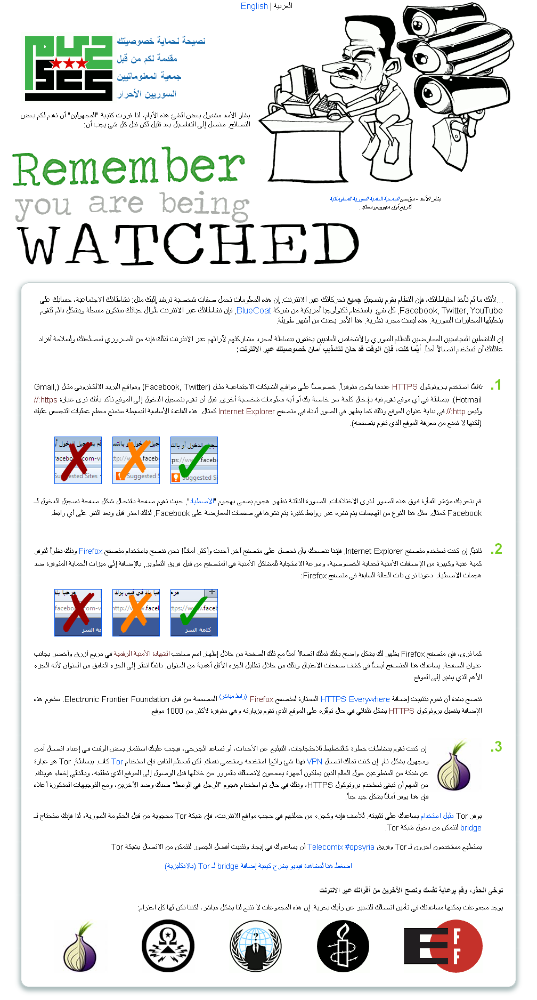

[**كتيبة RevoluSec التابعة لتنظيم Anonymous تخترق جملة من المواقع الإلكترونية التابعة للنظام السوري**](https://www.it-scoop.com/2011/09/revolusec-anonymous-syria/)

قامت كتيبة RevoluSec التابعة لتنظيم Anonymous [بالإعلان ](http://twitter.com/#!/RevoluSec)عن عمليتي اختراق استهدفت فيها 19 موقعا إلكترونيا تابعا للنظام السوري وذلك احتجاجا على طريقة تعامله مع مظاهرات شعبه.

تحاول RevoluSec من خلال عمليتها #OpSyria إيصال رسالة للشعب السوري بأن العالم يشاهدهم ، كما أنه إلى جانبهم مهما كانت السياسات الخاصة لدولهم.

<!-- more -->

تضمّنت القائمة الأولى 8 مواقع إلكترونية، 7 منها خاصة بالمدن السورية الرئيسية والثامن موجه للطلاب، بينما تضمّنت القائمة الثانية 11 موقعا إلكترونيا، تنوّعت بين وزارات سورية وبين مواقع أحزاب سياسية ومواقع إعلام لا تتبع في رسالتها المهنية سوى ما يمليه عليها النظام.

في لفتة مميزة منها شهد لها الكثيرون، قامت RevoluSec بوضع أسماء 2316 مواطن سوري استشهد خلال هذه المظاهرات وذلك حتى 31/8/2011 وتذكر RevoluSec بأنه تم التعرف على الكثير من الشهداء الآخرين منذ ذلك الوقت. ويمكن الحصول على متابعة دقيقة من خلال موقع Syrian Martyrs.

لم تتوقف RevoluSec عند هذا الحد، فقامت بكتابة دليل مبسط وسريع يذكر السوريين بالخطوات والنقاط الواجب الانتباه إليها عند تصفحهم الإنترنت وذلك لضمان خصوصيتهم في وجه تكنولوجيا أمريكية تستخدمها الحكومة السورية لتسجيل تحركات ونشاطات جميع السوريين على الإنترنت باستخدام تجهيزات Censorship من شركة BlueCoat الأمريكية.

نعرض لكم فيما يلي صوراً للصفحات الرئيسية للمواقع المخترقة:

<blockquote>

> 
> [http://itrc.gov.sy](http://itrc.gov.sy/)
> 
> 

> 
> [http://tartous-city.gov.sy/](http://tartous-city.gov.sy/)
> 
> 

> 
> [http://deirezzor-city.gov.sy/](http://deirezzor-city.gov.sy/)
> 
> 

> 
> [http://palmyra-city.gov.sy/](http://palmyra-city.gov.sy/)
> 
> 

> 
> [http://homs-city.gov.sy/](http://homs-city.gov.sy/)
> 
> 

> 
> [http://aleppo-city.gov.sy/](http://aleppo-city.gov.sy/)
> 
> 

> 
> [http://latakia-city.gov.sy/](http://latakia-city.gov.sy/)
> 
> 

> 
> [http://old-damascus.gov.sy/](http://old-damascus.gov.sy/)
> 
> 

> 
> [http://www.bakaloria.info/](http://www.bakaloria.info/)[/](http://itrc.gov.sy/)
> 
> 

> 
> [http://irrigation.gov.sy/](http://irrigation.gov.sy/)
> 
> 

> 
> [http://lattakiaport.gov.sy/](http://lattakiaport.gov.sy/)
> 
> 

> 
> [http://dgam.gov.sy/](http://dgam.gov.sy/)
> 
> 

> 
> [http://molsa.gov.sy/](http://molsa.gov.sy/)
> 
> 

> 
> [http://mot.gov.sy/](http://mot.gov.sy/)
> 
> 

> 
> [http://peegt.gov.sy/](http://peegt.gov.sy/)
> 
> 

> 
> [http://reformsy.org/](http://reformsy.org/)
> 
> 

> 
> [http://syrianparties.info/](http://syrianparties.info/)
> 
> 

> 
> [http://syriaface.com/](http://syriaface.com/)
> 
> 

> 
> [http://co.sy/](http://co.sy/)
> 
> 
</blockquote>
