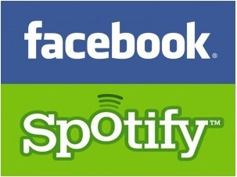

[**Spotify تجبر مستخدميها على استخدام حساباتهم على Facebook للاستفادة من خدمتها الموسيقية**](https://www.it-scoop.com/2011/09/spotify-facebook/)

ظهور Daniel Ek المدير العام لخدمة Spotify  الموسيقية على مسرح مؤتمر F8 الذي عقدته Facebook الأسبوع الماضي لم يكن من باب المجاملة، حيث قررت الشبكة الموسيقية "إجبار" مستخدميها على استخدام حساباتهم على Facebook إن هم أرادوا الدخول إلى موقعها من جديد.

ولم يمر هذا القرار مرور الكرام على مستخدمي هذه الخدمة، حيث أبدى الكثيرون امتعاضهم من الأمر، بالرغم من المزايا التي تود الشبكة أن تغري بها القادمين الجدد إليها، خاصة وأنه بمجرد أن يستمع المستخدم إلى أي مقطع موسيقي حتى يجده مكتوبا على كتابه  على Facebook ويظهر في قائمة Ticker اليمنى.

<!-- more -->

<iframe src="http://www.youtube.com/embed/FjAr5nGzjV8" height="315" frameborder="0" width="560"></iframe>

ويمكن أن نقرأ جانبا من تعليقات الممتعضين على [هذه الصفحة](http://www.bbc.co.uk/news/technology-15073457) على موقع BBC. فهناك من يتساءل عن ما إذا كانت الشبكات الاجتماعية تجبر مستخدميها على إنشاء حسابات جديدة للاستفادة من خدماتها، وهناك من قرر التوقف عن استخدام الخدمة، وثالث يرى الأمر عبارة عن "جنون مطلق".

وحسب Ek فإن غلب مستخدمي خدمته الموسيقية "اجتماعيون" ويملكون حسابات على Facebook وبالتالي فإنه يرى أنه من المنطقي ربط الخدمة بـFacebook .ويشبه الأمر بجواز سفر إلكتروني يسمح لمستخدميه التخلص من كلمة سر إضافية كان عليهم في السابق استخدامها لاستفادة من الخدمة الموسيقية.

تأتي هذه التغييرات ضمن التطويرات التي ستلحق بالعديد من المواقع الموسيقية وخدمات الفيديو على الإنترنت بعد شراكتها المعلنة مع Facebook والتي دخلت حيز التنفيذ منذ الخميس الفارط. وهي الشراكة التي عادت وستعود بالكثير من النفع عليها، فعلى سبيل المثال [يشير موقع inside facebook](http://www.insidefacebook.com/2011/09/26/spotify-gains-million-f8/) أن خدمة Spotify لوحدها حصلت على زيادة في عدد مستخدميها المواظبين عليها تجاوزت حاجز المليون مستخدم وهذا بُعيد الإعلان الرسمي عن شراكتها مع Facebook، حيث وصل هذا العدد إلى غاية 4.4 مليون مستخدم.

