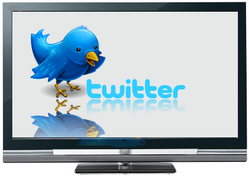
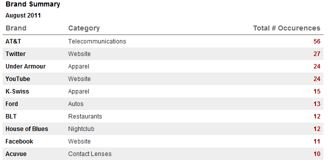

[**Twitter تحصل على دعاية أكبر من كبريات الشركات على القنوات الأمريكية دون أن تدفع مقابل ذلك**](https://www.it-scoop.com/2011/09/free-social-ads-on-tv/)

لم يعد الظهور على شاشات القنوات التلفزيونية الأمريكية حكرا على الشركات الكبرى. Twitter،Facebook  و Youtube أصبحت تملك حصة معتبرة من الدعاية على هذه القنوات وهذا دون أن تدفع أي سنت مقابل ذلك.

وتشير [أرقام شركة  Nielsen](http://adage.com/article/mediaworks/twitter-leads-product-placement-pack-tv-roles/229994/) أن Twitter  حصل على المركز الثاني من حيث الدعاية التلفزيونية في شهر سبتمبر الجاري ، وذلك خلف شركة AT&T  التي دفعت ثمنا مقابل ذلك. في حين حلت Youtube التي تعتبر وسيلة دعاية مثلى للعديد من البرامج التلفزيونية ثالثا، وFacebook تاسعا.

تلجأ القنوات التلفزيونية للترويج بشكل غير مباشر للشبكات الاجتماعية ولذلك للترويج لحساباتها عليها للحصول على المزيد من المتابعين، فلم يعد من الغريب أن يطلب منشط/مقدم حصة من المشاهدين أن يرسلوا أسئلتهم باستخدام HashTag معين على Twitter، أو أن تظهر رسالة تفيد بأن الممثل الفلاني يقوم حاليا بالتغريد على الحلقة الحالية من المسلسل ونحو ذلك.

في رأيك هل تسعى القنوات التلفزيونية بهذه الطريقة إلى الحصول على مشاهدين إضافيين، أم أنها تخشى ضياع المشاهدين الحاليين وتوفر لهم سبل البقاء على اتصال مباشر بهم؟
