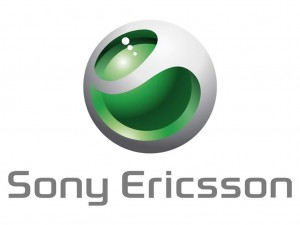
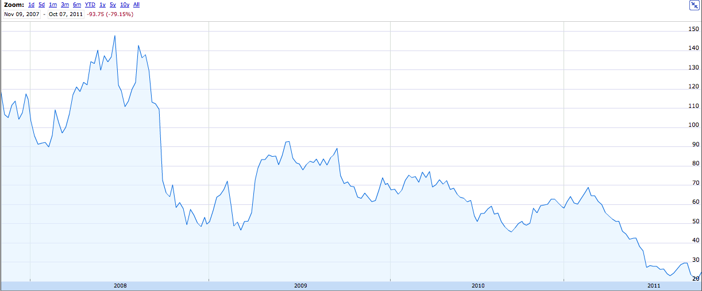

**تحديث (27.10.2011):** Sony تشتري رسميا النصف الثاني من Sony Ericsson

أعلنت اليوم كلا من Sony و Ecrisson -[عبر خلال بيان صحفي](http://www.marketwire.com/press-release/ericsson-sony-to-acquire-ericssons-share-of-sony-ericsson-stkm-eric-1578330.htm)- شراء الأولى لحصة الثانية من شركة  Sony Ericsson، وذلك بعد أزيد من أسبوعين عن أولى الأخبار/الإشاعات حول قرب عملية الشراء (اقرأ الخبر السابق أدناه). وستدفع Sony لقاء ذلك 1.47 مليار دولار.

[**Sony تقترب من شراء النصف الثاني من Sony-Ericsson وRIM قد تكون من نصيب Vodafone**](https://www.it-scoop.com/2011/10/sony-sonyericsson-rim-vodafone/)

حسب [جريدة Wall Street Journal](http://online.wsj.com/article/SB10001424052970204294504576614830784818082.html) فإن Sony تقترب أكثر فأكثر من شراء النصف الثاني من شركة Sony-Ericsson التي أنشأتها مناصفة مع Ericsson منذ عقد مضى ومن المتوقع أن تدفع أزيد من 1.3 مليار دولار مقابل ذلك.

وتشير الجريدة إلى أن Sony تهدف بذلك إلى تجميع خطوط إنتاجها الخاصة بكل من الهواتف، منصات الألعاب والحواسيب الشخصية والمحمولة معا، وذلك لتحسين نوعية إنتاجها ولخفض التكاليف. وتسعى Sony من خلال هذه الخطوة إلى انقاذ هذه الشركة التي يشهد رقم أعمالها تراجعا يقدر بـ32% خلال عام واحد، ويعود الأمر بشكل مباشر إلى المنافسة القوية من طرف Apple وSamsung.

ليست Sony-Ericsson الوحيدة التي أتعبها هذه المنافسة القوية، حيث تشير [نفس الجريدة](http://blogs.wsj.com/deals/2011/10/05/research-in-motion-jumps-on-rumor-of-the-day/?mod=WSJ_qtoverview_wsjlatest) أن مصير Research in Motion لم يعد في يدها مثلما كان في السابق، وقد ظهرت العديد من الإشاعات التي تشير إلى إمكانية بيع الشركة . فبعد أن ذُكر اسم Microsoft سابقا، ظهرت مؤخرا إشاعات ترجع أن تكون هواتف BlackBerry من نصيب Vodafone.

رغم كون الأمر مجرد إشاعات، إلا أن احتمال حدوث تغييرات مهمة على الشركة أصبح أمرا شبه مؤكد. ولقد نقل [موقع Cyberpresse الكندي](http://lapresseaffaires.cyberpresse.ca/economie/technologie/201110/05/01-4454583-le-titre-de-rim-bondit-sur-fond-de-rumeurs.php) تصريحات Vic Alboini رئيس مؤسسة Jaguar Financial الاستثمارية الكندية -التي تملك قرابة 5% من أسهم الشركة- التي يقول فيها:

<blockquote>

> 
> كون الإشاعات صحيحة أو كاذبة ليس بالأمر المهم. الأهم هو أن المؤسسة على وشك أن تشهد تغييرات
> 
> 
</blockquote>

هذا ولقد عرف سهم RIM تراجعا يقدر بحوالي 83% [خلال السنوات الثلاث الأخيرة](http://www.google.ca/finance?chdnp=1&chdd=1&chds=1&chdv=1&chvs=maximized&chdeh=0&chfdeh=0&chdet=1318017600000&chddm=384687&chls=IntervalBasedLine&q=TSE:RIM&ntsp=0&fct=big). فبعد أن كان مقدرا بـ148 دولارا في يونيو 2008 هبط سعر السهم ليصل إلى 24.49 دولار لدى إغلاق بورصة تورونتو الأربعاء المنصرم.

