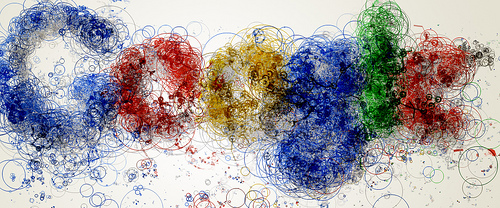

مرة أخرى ومع أهم تحديثات Google التي كشفت عنها خلال هذا الأسبوع والتي تتوزع هذه المرة ما بين نتائج مالية، منتجات قادمة، وأخرى انضمت إلى قائمة "المنتجات السابقة" للشركة.

كشفت Google عن[ تقرير لنتائج الرّبع الثّالث](http://investor.google.com/earnings/2011/Q3_google_earnings.html) من هذا العامّ، ويبدو أن أرباحها قد تجاوزت توقّعات المحلّلين.

	  * عائدات الشّركة لهذا الرّبع بلغت 10 مليار دولار أمريكيّ تقريبًا، بزيادة مليار دولار عن معظم التوقّعات.
	  * نمت عائدات الشّركة بنسبة 33%.

## Google+

	  * عدد مستخدمي Google+ تجاوز 40 مليونًا.
	  * عدد الصّور المرفوعة حوالي 3.4 مليار.
	  * عن Google+ قال Lary Page، أحد مؤسّسَي الشّركة والمدير التّنفيذيّ حاليًّا: "في الرّبع الماضي من العامّ، أطلقنا الجزء زائد (+)، الآن حان دور جزء Google".
	  * [أُحيلت](http://googleblog.blogspot.com/2011/10/fall-sweep.html?spref=tw) بضع منتجات منها Google Buzz مع واجهته البرمجيّة (API) إلى التّقاعد. يمكنك تحميل منشوراتك من خلال [Google Takeout](https://www.google.com/takeout/).

من التعديلات الصغيرة في Google+:

	  * إذا كنت تملك حسابًا في Google+ وقمت بتسجيل الدّخول إليه، فإنّ النّقر على رابط الصور (Photos) في الشّريط الأسود العلويّ في أي من منتجات Google سينقلك إلى صفحة الصّور في Google بدل Picasa Web Albums في السّابق.
	  * دعم الوسوم (hashtags) كما في Twitter، وقد جربتها بالعربيّة والإنكليزيّة ضمن المنشورات والتّعليقات وهي تعمل. سيظهر الوسم كرابط يؤدّي النّقر عليه إلى إظهار نتائج البحث عن هذا الوسم.
	  * البحث الفوري كما في Twitter: حيث ستظهر رسالة تشير إلى وجود منشورات جديدة في نتائج البحث.
	  * في السّابق، كان بإمكانك منع إعادة مشاركة منشوراتك أو التّعليق عليها بعد نشرها، الآن يمكنك فعل هذا قبل نشرها عن طرق رمزين يظهران فوق زرّ المشاركة.

Android

مجموع الأجهزة الّتي تعمل بنظام Android حول العالم يبلغ 190 مليونًا، وهذا يعني أنّ أكثر من 500 ألف جهاز تفعّل يوميًّا منذ شهر أيّار (مايو) من هذا العام، باعتبار أنّ Google صرّحت بوجود 100 مليون جهاز في بداية شهر أيّار (مايو).

سيعلن عن هاتف Nexus Prime مع نظام Android Ice Cream Sandwich الّذي يقول Lary Page [إنّه سيكون "رائعًا"](http://ardroid.com/2011/10/14/larry-page-talking-ics-incredible-you-wont-beleive-what-we-managed-to-do-in-this-release/) يوم الأربعاء القادم، 19 تشرين الأوّل (أكتوبر) ضمن مؤتمر Samsung Mobile Unpacked في هونغ كونغ.

## منتجات أخرى

	  * أضافت Google دعم WebGL في Maps، وهذا يسمح بعرض مجسّمات ثلاثيّة البعد ضمن المتصفّحات الّتي تدعم تقنيّة WebGL (مثل النّسخ الحديثة من Chrome وFirefox) دون الحاجة إلى تثبيت إضافات. ستحتاج أيضًا إلى مواصفات مناسبة في حاسوبك. شاهد الفيديو لمزيد من التّفاصيل:

<!-- more -->

<iframe src="http://www.youtube.com/embed/X3EO_zehMkM" height="315" frameborder="0" width="560"></iframe>

تحسينات شكلية على Translate وMaps وDocs وCalendar لتتوافق مع التّصميم الجديد لخدمات الشّركة.
