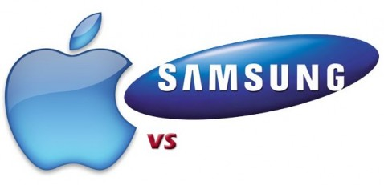

لا يبدوا أن لمسلسل صراع Samsung و Appleمن نهاية فبعد أن نجحت الأخيرة في منع تسويق وبيع هواتف Galaxy S ، Galaxy SII  وأجهزة Galaxy Tab 10.1 اللوحية في أوروبا قبل شهرين ونيف، ها هي اليوم Samsung تحاول رد الصاع لـ Apple بتقدمها [بطلب منع بيع جهاز iPhone 4S](http://thenextweb.com/apple/2011/10/17/samsung-seeks-iphone-4s-sales-ban-in-japan-and-australia/) الجديد في كل من اليابان وأستراليا.

ولقد أشارت Samsung في طلبها للإيقاف أن Apple قد تعدت على براءة اختراع تخصها في مجال معايير الاتصال اللاسلكي، كما ذكرت الشركة بأن لديها طلبات مسبقة لمنع بيع كل من iPhone 4 و iPad 2 في البلدين المذكورين أعلاه .

هذا ما حدث خلال هذه الأيام فقط، لكن إن رجعنا في الخط الزمني قليلا (لا نقصد هنا خط Facebook الزمني :p)، فشركة التفاحة المقضومة ردت على رائدة التكنولوجيا في شبه الجزيرة الكورية وفي معقلها العاصمة الكورية الجنوبية Seoul حيث [متهمة إياها](http://thenextweb.com/apple/2011/10/14/apple-to-samsung-your-mobile-patent-lacks-novelty-and-you-didnt-invent-it/) بأنها لم تكن من اخترعت 234 من براءات الاختراع التي تقول Samsung التي تملكها. وتواصل Apple هجومهما بوصفها للبراءات المملوكة للعملاق الكوري الجنوبي لأنها تفتقر للإبداع والجودة مثل مثيلاتها في [أغلى شركة في وادي السيليكون](../2011/08/nasdaq-takes-sharp-fall/).

للأسف لم يعد بالإمكان وصف الطريقة التي تتصرف بها كلتا الشركتين بـ"النظيفة"، فكما حصل سابقا وتربصت Apple بهاتف Galaxy S II  يوم صدوره ومنعه من البيع بقرارات المحكمة الأوروبية ها هي اليوم Samsung تفعل نفس الشيء ... والضحية بالطبع هي المستهلك. فبدل أن يكون في مكانه المعتاد من قضية التنافس - أي أن يكون الرابح الأكبر- ها هو اليوم يصبح الخاسر الأكبر بكل المعايير، فكلا الهاتفين يعتبران -بطريقة ما- آخر ما توصلت إليه تكنولوجيا الهواتف الذكية .

في المقابل تطل علينا الشركتان بإعلانات دعائية حول مبيعات هواتفها الذكية ، حيث [قالت](http://techcrunch.com/2011/10/17/the-iphone-4s-is-a-sirious-hit/) Apple أنها تمكنت من بيع 4 مليون جهاز iPhone 4S  الجديد خلال عطلة نهاية الأسبوع الماضية، متخطية بذلك رقمها السابق ومضاعفة إياه مرتين، حيث كان الرقم السابق مملوكا لسلفه  iPhone 4. في حين [أعلنت](http://thenextweb.com/mobile/2011/10/17/samsungs-galaxy-s-and-galaxy-s-ii-smartphones-top-30-million-combined-sales/)Samsung  أن أرقام مبيعات كل من هواتف Galaxy S و Galaxy S II تجاوزت 30 مليون قطعة، وهو أكبر رقم في تاريخها، كما تعتبر هذه الأجهزة أسرع أجهزة الشركة مبيعا .

 في رأيك، في ظل هذا النجاح الباهر لكلا الشركتين، إلى متى سيستمر الصراع؟ وهل سنرى بوادر انفراج أم فصول تأزم جديدة؟
