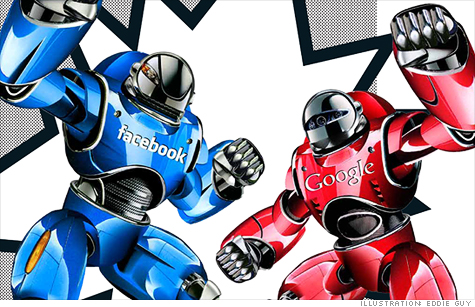

_هذا المقال في معظمه مترجم عن [هذا التّقرير لـFortune](http://money.cnn.com/2011/11/03/technology/facebook_google_fight.fortune/index.htm?fb_ref=fbLike&fb_source=profile_oneline). بعد حذف بعض النّقاط وتعديل وتبسيط أخرى._

الكلّ يعلم من يسيطر على سوق الشبكات الاجتماعية اليوم، إنّه بلا شكّ Facebook، الشّبكة الاجتماعيّة ذات 800 مليون مستخدم. لكنّ دوام الحال من المحال، فقد كانت MySpace متفوّقة على Facebook منذ سنوات قليلة، الأمر الّذي تفهمه Facebook تمامًا وتخشاه؛ وكذلك تفهمه Google.

لم يسبق أن شهد تاريخ الويب صراعًا كهذا بين شركتين كبيرتين تتنافسان على السّيطرة على حياتنا الرّقميّة (أو قسم كبير منها)، لا شكّ أنّ النّتيجة النّهائيّة لهذه الحرب ستغيّر طريقة حصولنا على المعلومات! 

العمل الرّئيسيّ لـGoogle هو الإعلانات، فهي ما تزال جديدة في سوق أنظمة التّشغيل للهواتف المحمولة وإن كانت حقّقت نجاحًا باهرًا مع Android. قد تظن أنّه يمكن للشّركتين أن تستمرّا في النّجاح معًا وتشارك حصّة السّوق، لكنّ Jordan Rohan، الباحث والمحلّل لدى Stifel Nicolaus له رأي آخر:

<blockquote>من المستبعد جدًّا أن يمكن لـGoogle وFacebook الاستمرار في النّمو بالمليارات الّتي يتوقّعها المستثمرون في سوق الإعلانات دون أن تسرق إحداهما حصّة الأخرى.</blockquote>

يؤكّد هذا ما يتوقّعه المحلّلون من نموّ لعائدات الإعلانات لكلا الشّركتين هذا العام: 81% لـFacebook مقابل 34% لـGoogle. لا ينفي هذا أنّ لـGoogle حصّة الأسد من سوق الإعلانات اليوم؛ لكنّ الرّقم 800 مليون مستخدم يعني الكثير للمستثمرين، خاصّة إذا علموا أنّ الكثير منهم يقضون معظم أوقاتهم على الإنترنت على Facebook.

إذا أردنا الحديث بصورة شخصيّة، فلا بدّ لنا من ذكر Larry Page، أحد مؤسّسَي Google والمدير التّنفيذيّ لها حاليًّا، وMark Zuckerberg. الأوّل أكبر سنًّا من الأخير بأحد عشر عامًا، وهو ما يعني أنّهما ينتميان لجيلين مختلفين من أجيال الويب، إن صحّت التّسمية. لكلّ منهما نظرة مختلفة للعمل على الويب، فالأوّل يفهم أنّ أوّل ما يبدأ به هو البحث على الويب ليصل إلى مراده، بينما الأخير يفهم الويب على أنّها شبكة من الأصدقاء والمعارف، وعليه أن يعتمد عليهم ليصل إلى ما يريد من المعلومات.

<!-- more -->

**من نقاط قوّة Facebook:**

	  * قاعدة مستخدمين كبيرة ومخلصة، 800 مليون مستخدم يقضي كثير منهم أوقاتهم على الويب ضمن Facebook غالبًا. وهذا يعني معلومات كثيرة وفيها طابع اجتماعيّ وشخصيّ يساعد في توجيه إعلانات ملائمة لكلّ مستخدم،على عكس فهارس البحث في Google الّتي تحتاج إلى أن تكون اجتماعيّة أكثر.
	  * مئات التّطبيقات والمواقع الشّهيرة الّتي تعتمد على علاقاتك مع أصدقاء Facebook لتظهر لك محتوىً يناسبك. على سبيل المثال: موقع Spotify يستخدم Facebook ليعرف ماذا يعجبك من الأغاني؛ وموقع Yelp يستخدمه ليعرض لك آراء أصدقائك في مطعم أو مقهى تريد زيارته.
	  * معظم محتوى Facebook لا يمكن رؤيته عبر عناكب Google التي تزحف على صفحات الويب وتحلّلها لتضمّها إلى فهارس البحث. وإن لم نكن نفهم هذا بوضوح اليوم، فلا شك أنّنا سنرى في المستقبل أنّ البحث غير الاجتماعيّ يعطي نتائج غير مرغوبة أو غير ملائمة: وهذا وضع بحث Google اليوم، وعليه التّحرّك إن أراد البقاء، فهو يخسر كل يوم من دقّته وفعّاليّته شيئًا.

**من نقاط قوّة Google:**

	  * شهرة محرّك البحث Google: تستطيع Google استغلال شهرة محرّكها لتدعو المستخدمين إلى تجربة منتجاتها الجديدة مثلاً، كلّ ما كان على Google فعله لتجذب 40 مليون مستخدم لشبكتها الجديدة هو استغلال شهرتها لدعوة المستخدمين ثمّ رسم سهم أزرق يشير إلى رابط Google+ في النّاحية العلويّة من صفحة البحث الرّئيسيّة، والمثير أنّها حقّقت ذلك في أربعة شهور تقريبًا. تقوم Google باستخدام البحث لتعرض منتجات أخرى حاليًّا، فالبحث عن اسم مكان قد يعطي نتيجة بحث من الخرائط، والبحث عن معنى كلمة قد يعطي نتيجة من التّرجمة أو غيرها. مع ذلك لم تفعل هذا مع Google+ بعد، لعلّ السّبب هو أنّها تخضع للتّحقيق في قضيّة احتكار؛ فهذه الخطوات مثيرة للجدل بالفعل.
	  * 

منتجات كثيرة: بالإضافة للبحث، لدى Google قاعدة كبيرة من المستخدمين لمنتجات عديدة: Gmail، التّرجمة، الخرائط، Reader، المجموعات، Docs، المدوّنات (Blogger)، الأخبار، Picasa، ولا ننسى Chrome وYouTube وAndroid! والحقيقة أنّني شخصيًّا أستخدم معظمها بشكل يوميّ. كون هذه المنتجات مملوكة لشركة واحدة يجعلها أكثر ترابطًا، لن تحتاج لحسابات عديدة، ستشعر أنّك تعمل في مكان مألوف في كلّ مرّة تستخدم إحدى هذه المنتجات.

	  * حصّة كبيرة في سوق الهواتف والأجهزة اللّوحيّة.

كلا الشّابين غير مطمئن، فـLarry يدرك تمامًا أن Facebook يغزو العالم الرّقميّ، ستلاحظ زرّ Like في كلّ صفحة تزورها تقريبًا، ومع وجود إشاعات عن نيّة Facebook تطوير نظام إعلانات جديد، فمن حقّ Larry أن يشعر بالقلق.

من النّاحية الأخرى Mark قلق أيضًا: فمنذ أن تسرّبت معلومات عن نيّة Google إطلاق شبكة اجتماعيّة (قاتل Facebook، كما قيل حينئذٍ) في صيف 2010، استدعى Mark موظّفيه وأعطى تعليمات بزيادة أوقات العمل، 60 يومًا قضوها يحسّنون كلّ شيء أساسيّ تقريبًا في الشّبكة: الصّور، المجموعات، المناسبات وغيرها. حتّى أنّ الموظّفين عملوا في أيّام العطل، وفتحت المقاصف لأطفالهم ليلعبوا ويأكلوا بينما ينتهي آباؤهم من العمل!
في الوقت الّذي يتّهم فيه Zuckerberg خصمه بنسخ أفكارهم، لاحظنا[ كيف أضاف Facebook مؤخّرًا ميّزات مشابهة لتلك الموجودة في Google+](https://www.it-scoop.com/2011/09/facebook-google-plus/). هل يعني هذا شيئًا؟ أتصوّر أنّه يثبت قلقه، وفي نفس الوقت يساعدنا في فهم أنّ كلّاً من الشّركتين لن تتردّ في "تقليد" الأخرى، فالمهمّ هو السّيطرة.

أيضًا نتذكّر هنا اتّهامًا وجّه لـFacebook بمحاولة تشويه سمعة Google بمستندات ومدوّنات عن انتهاكها للخصوصيّة؛ وهذا حدث في شهر أيّار/مايو. الفكرة ببساطة أنّ كلا الشّركتين تحاولان امتصاص معلوماتنا الشّخصيّة وتوجيهها في الإعلانات، لكنّهما مضطّرتان للحفاظ على خصوصيّتنا قدر الإمكان، إن صحّ هذا التّعبير.

لم يتوقّف Facebook هنا بل أعلن في مؤتمر F8 عن شراكته مع خدمة Spotify الموسيقية وأطلق خاصيّة Timeline بدل Profile، وهو شكل مطوّر للملفّات الشّخصيّة يسمح لك بمراجعة منشوراتك بترتيب زمنيّ وبشكل سهل وكأنّك تتصفّح سيرة حياتك أو مذكّراتك. إذًا Mark لا يكتفي بالدّفاع، بل يهاجم!

ثمّ في أواخر الشّهر الماضي أزاح Larry Page خصمه Mark Zuckerberg عن منصب المستخدم الأكثر إضافة إلى دوائر الآخرين على Google+ (بكلمتين: most circled). قد لا يعني هذا شيئًا، لكنّه يبقى تعبيرًا رمزيًّا يفهم المدوّنون التّقنيّون كيف يستثمرونه.

نلاحظ أيضًا إنّه إمّا أن يكون المهندس ذو الشّأن يعمل لدى Google أو لدى Facebook، والشّركتان في صراعٍ دائمٍ لاجتذاب هؤلاء. 4 من أعلى 11 منفّذًا (executive) في Facebook كانوا في Google سابقًا. قيل أيضًا أنّ Google عرضت على موظّف لديها 10 مليون دولار ليبقى لديها، وهذا ما جعل الكثيرين يدّعون حصولهم على عرض للانتقال إلى Facebook كذبًا، كما قال مختصّ في هذا الأمر. نذكر هنا أنّ Google رفعت رواتب موظّفيها أيضًا.

Google قادرة على جذب الملايين من المستخدمين لخدماتها الجديدة، يقول  Dick Costolo، المدير التّنفيذيّ لـTwitter:

<blockquote>بلا شكّ سيجذبون أعدادًا هائلة من المستخدمين</blockquote>

يقصد Google طبعًا. ولعلّ هذا هو أكثر ما يقلق Facebook.

نعود إلى سوق الهواتف المحمولة والأجهزة اللّوحيّة: قطعت Google أشواطًا كبيرة في هذا المجال، مع مئات الآلاف من التّطبيقات في المتجر وأكبر حصّة من سوق الهواتف وحصّة تنمو من سوق الأجهزة اللّوحيّة، قد تستغلّ Google نجاحها لتقدّم ميّزات جديدة في Google+ تتعلّق بنظام Android بحيث تكون مرتبطة بكليهما، الأمر الّذي لا حيلة لـFacebook لمواجهته وحيدًا.

وهذا ما[ دعاها إلى اللّجوء إلى Apple](http://www.businessinsider.com/facebook-ran-to-apple-to-figure-out-a-partnership-after-google-launched-2011-11) بحسب [Fortune](http://money.cnn.com/2011/11/03/technology/facebook_google_fight.fortune/index.htm?iid=SF_F_Lead). يقول الخبر إنّ عدة اجتماعات عقد بين الشّركتين للاتّفاق على كيفيّة التّعاون، لكنّها لم تصل إلى شيء (حتّى الآن على الأقلّ)، ربّما بسبب خلافات سابقة: أتذكرون عندما رفضت Facebook ربط شبكة Ping الّتي اطلقتها Apple ضمن iTunes في السّابق؟ عندها ادّعت أنّ أسبابًا تقنيّة تقف خلف هذا الرّفض.

اليوم تصبّ هذه المنافسة في صالحنا، على المستوى الشّخصيّ على الأقلّ: فأن تتفرّد شبكة واحدة بمعلوماتنا فهذا يعني أنّها لن تتردّد في تغيير إعدادات الخصوصيّة متى أرادت (مع الحذر من القضاء)، أمّا مع وجود شبكة أخرى، فإنّ كلتيهما ستاخذان بالحسبان وجود الأخرى، وفي حال سخط المستخدم على إحداهما، فسترحّب الأخرى به دون تردّد!
