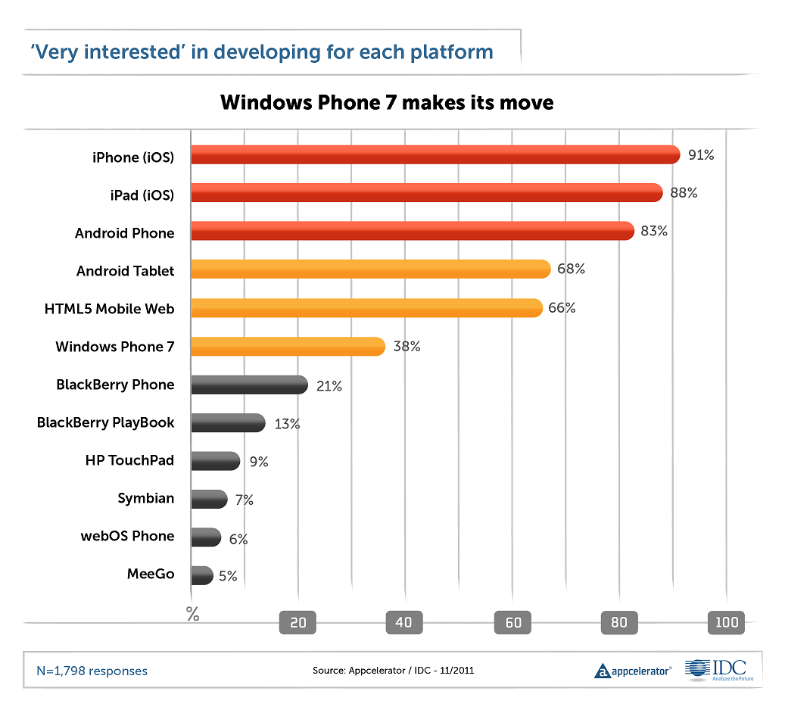

أشارت [دراسة](http://www.appcelerator.com/company/survey-results/mobile-developer-report-nov-2011/report/) أعدتها **Appcelerator** بالشراكة مع **IDC** أن 38% من مجمل 2160 مطور شملتهم الدراسة أبدوا اهتماما كبيرا بنظام **Windows Phone 7**.

ولقد عبر 48% منهم أن اهتمامهم بالتطوير لهذا النظام زاد بعد الإعلان عن [الشراكة التي عقدتها Microsoft مع Nokia](../2011/02/nokia-microsoft-windows-phone-7/). في حين أشار 28% أن إطلاق **Nokia** لهاتف **Lumia** المجهز بنظام **Windows Phone 7** يقف وراء زيادة اهتمامهم.

وتأتي هذه الدراسة لتؤكد بشكل ما، [دراسة](../2011/06/windows-phone-7-developers-interest/) أعدتها سابقا **Mobile Vison** والتي تشير إلى اهتمام كبير جدا بنظام **Windows Phone 7** يصل إلى حد تجاوز كلا من **Chrome OS** و **iOS**.

أما الخاسر الأكبر فهو -مثلما هو متوقع- نظام **BlackBerry OS** الذي تراجعت نسبة المطورين "المهتمين جدا" بالتطوير له إلى 21%، في حين تراجعت نسبة الاهتمام بالتطوير لجهاز PlayBook اللوحي إلى 13%. مما يزيد من تعقيد الحالة التي تعرفها **RIM** المنتجة لهواتف **BlackBerry** التي تعيش أحلك أيامها بعد سلسة من الانقطاعات في شبكتها وتراجع حاد ل[سعر أسهمها](../2011/11/rim-stock-falls-below-book-value/).

وكالعادة لا يزال اهتمام المطورين بنظامي **iOS** و **Android** عال جدا، حيث أبدى 91% من المطورين رغبة في التطوير للأول، و83% منهم رغبة في التطوير للثاني.

على صعيد آخر،  كشفت دراسة سابقة [نشرتها **Evans Data**](http://www.computerworld.com/s/article/9221678/Linux_loses_its_luster_as_a_darling_among_developers) عن تحول اهتمام المطورين في أمريكا الشمالية من نظام **Linux** ليحط على نظام **Mac OS**، وهذا بسبب اتجاه أنظارهم إلى مجالات جديدة كالتطوير للهواتف الذكية والحوسبة السحابية.

حسب هذه الدراسة فإن نسبة المطورين الذين لا يزالون يعملون على نظام **Linux** في أمريكا الشمالية  تُقدر بحوالي 5.6%، في حين تصل نسبة نظرائهم على نظام **Mac OS** إلى 7.9%، أما نظام **Windows** فلا يزال يُحلق عاليا لوحده بنسبة 80%.

ما هي قراءتك لهذه الأرقام؟ وهل ستلعب أنظمة تشغيل الهواتف دورا في النظام الذي يختاره المطورون على حواسيبهم؟
