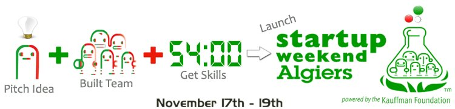

ينظم النادي العلمي للمدرسة الوطنية العليا للإعلام الآلي CSE النسخة الثانية من مسابقة **Startup Weekend** التي تمتد فعالياتها ما بين 17 و 19 نوفمبر الجاري وهذا لتمكين الطلبة الراغبين في إطلاق مشاريعهم الخاصة بالقيام بذلك خلال ظرف 54 ساعة.

تأتي هذه النسخة الجديدة من المسابقة أشهرا قليلا فقط بعد النسخة الأولى التي احتضنتها حاضنة مشاريع TechnoBridge والتي أقيمت ضمن نشاطات [أسبوع الويب](../2011/04/semaine-du-web-alger/) خلال شهر أبريل الماضي. لكن ما يميز هذه النسخة هو تأهل الفريق الفائز لتمثيل الجزائر في مسابقة [**Global Startup Battle**](http://globalstartupbattle.com/) التي ستقام لاحقا لتضم الفائزين في مسابقة Startup Weekend من 65 دولة.

ليس هذا فحسب سيحصل الفريق الفائز على فرصة للإقامة في حاضنة مشاريع  TechnoBridge وحصوله على رخصة BizSpark تسمح له بالحصول على كافة منتجات Microsoft مجانا، إلى جانب صك بقيمة 200 دولار لخدمة Amazon Web Services.

يمكن متابعة أحداث المسابقة التي ستمتد إلى غاية مساء يوم غد على [صفحتها على Facebook](https://www.facebook.com/StartupWeekendAlger). أو على Twitter بمتابعة  Hashtag التالي: [#swalgiers ](https://twitter.com/#!/search/swalgiers)
