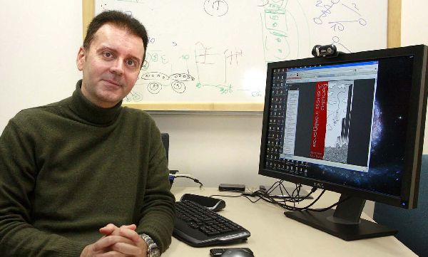

إن كانت جميع المحاولات السابقة لإنشاء محرك بحث جديد ينافس Google بشراسة قد مرت بسلام على Larry Page وSergey Brin فإن الإعلان عن قرب إطلاق محرك **[volunia](http://volunia.com/)** قد يثير انتباههما بشكل جدي، خاصة وأن الذي يقف وراء المشروع هو الرياضي الإيطالي **Massimo Marchiori**.

Marchiori هو صاحب [خوازرمية HyperSearch](http://www.w3.org/People/Massimo/papers/WWW6/) التي اعتمد عليها مؤسسا Google للعمل على [خوارزمية PageRank](http://ilpubs.stanford.edu:8090/422/1/1999-66.pdf) التي بُني عليها محرك البحث. وينوي Marchiori إطلاق محرك البحث قبل نهاية السنة، إلا أنه رفض الإدلاء بأية تفاصيل حول المشروع.

Marchiori الذي يرى أنه لا يسعى لإنشاء محرك بحث له قدرات تفوق Google بنسبة 10%، لكنه يصف الطريقة التي سيتعمد عليها محرك volunia بالبسيطة، بالرغم من كونها تحمل مفهوما آخر لما قد يمكن لمحركات البحث أن تكون عليه.

ويضيف:

<blockquote>

> 
> لو لم أكن أؤمن بقوة المشروع، وقدرته على منافسة محركات البحث الحالية لما عملت شخصيا عليه
> 
> 
</blockquote>

أما عن سر الامتناع عن الإدلاء بأية معلومات حول volunia فإن Marchiori يخاف أن تقوم شركات مثل Google بتخصيص عدد كبير من مهندسيها لتنفيذ الفكرة قبل أن ينطلق محرك volunia.

الفيديو الترويجية لمحرك بحث volunia :

<!-- more -->

<iframe src="http://www.youtube.com/embed/-Ph9S2xeCSU" height="315" frameborder="0" width="560"></iframe>

في رأيك، هل سيقدر Marchiori على إحداث ثورة في محركات البحث كما أحدثها Google الذي اعتمد سابقا على إحدى خوارزمياته؟

