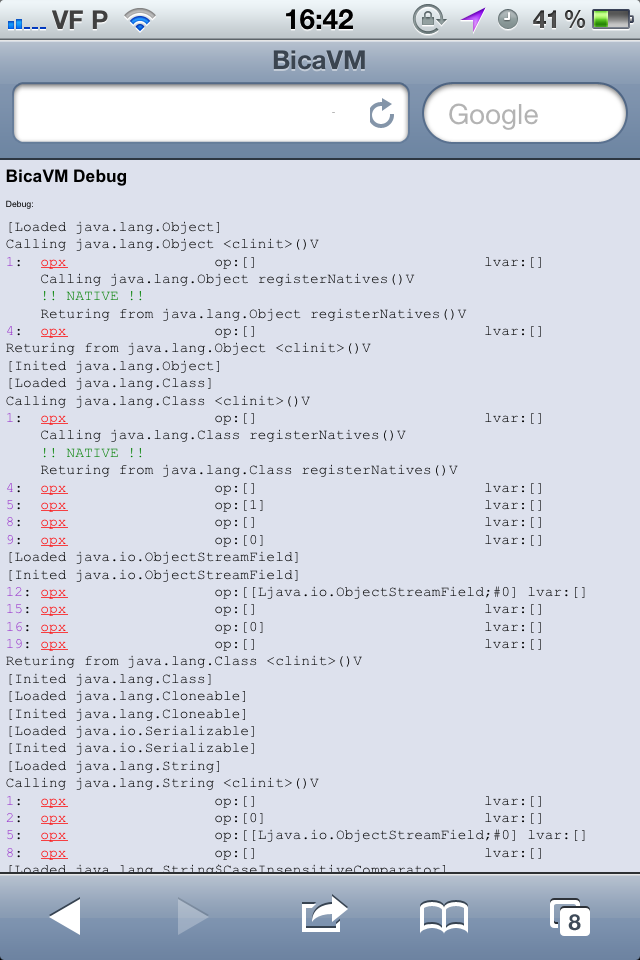

الأفكار التي قد تخطر على بال المبرمجين لا حدود لها، ومن بين هذه الأفكار تلك التي خطرت على بال المبرمج البرتغالي **[Artur Ventura](http://www.surf-the-edge.com/)** الذي قرر كتابة آلية افتراضية بلغة JavaScript لتمكين من تنفيذ تطبيقات Java داخل المتصفح.

المشروع الذي أطلق عليه اسم **BicaVM** لا يزال في مراحله الأولى، و[حسب](http://www.i-programmer.info/news/167-javascript/3360-javascript-jvm-runs-java.html) Ventura فإن بعد 6 أشهر من العمل أصبح بإمكان BicaVM أن ينفذ حاليا حوالي 60% من ByteCode. ويهدف المطور إلى تمكين المتصفحات التي تعمل على أجهزة لا تقبل أي نوع من الإضافات بتشغيل تطبيقات Java، ويضرب مثالا بمتصفح Safari على نظام iOS، حيث نشر صورة على مدونته تبين تمكنه من تنفيذ برنامج Java.

قد تبدو الفكرة جدية وجيدة، خاصة مع التزايد المستمر لسرعة تنفيذ شفرات JavaScript على مختلف المتصفحات، لكن ألا يدفع الأمر للتساؤل عن جدوى كتابة آلة افتراضية تعمل داخل آلة افتراضية أخرى، ماذا لو كان المتصفح يعمل هو بدوره أيضا في نظام مشغل كآلة افتراضية (ألا يذكركم ذلك بأية أفلام هوليودية؟).

في المقابل، فقد سبق لمطور آخر أن أطلق مشروع [JSava](http://www.zortrium.net/programs/show.php?id=13) الذي يمكنه [تنفيذ أغلب برامج Java](http://developers.slashdot.org/comments.pl?sid=2536010&cid=38122808)، والذي كتب بلغة JavaScript ليعمل داخل الآلة الافتراضية [Rhino](http://www.mozilla.org/rhino/) الخاصة بلغة JavaScript والتي هي بدورها مكتوبة بلغة Java، إلا أنها لا تعمل على المتصفحات.

ما رأيك في كل هذا المحاولات الرامية إلى تشغيل برامج وتنفيذ شفرات برمجية بلغات مختلفة داخل المتصفح؟ هل نتجه إلى جيل جديد من أنظمة التشغيل والأجهزة التي تعتمد حصريا على المتصفحات؟
