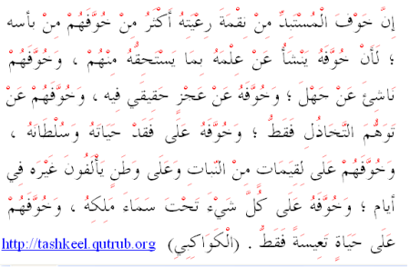
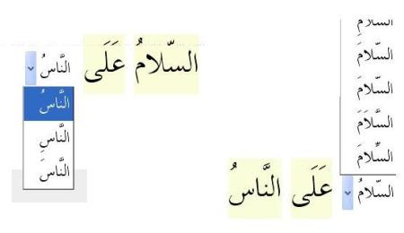

أطلق الأستاذ [طه زروقي](https://twitter.com/linuxscout/) الإصدار التجريبي من برنامج [مشكال](http://tashkeel.qutrub.org) لتشكيل النصوص العربية آليا والذي يعد نتيجة سلسلة من المشاريع العربية المتكاملة التي طُورت في هذا المجال لتوفير حل لمعالجة اللغة العربية بصورة آلية.

يأتي هذا المشروع في طلّ فراغ كبير، ليقدّم أول مشروع مفتوح المصدر للتشكيل والوحيد المتاح حاليا على الإنترنت، حيث سبق وأن أطلقت Google مشروعا خاصا بالتشكيل قبل أن تقرر توقيفه.

**من مزايا البرنامج:**

	  *  تشكيل آلي للنصوص العربية،
	  *  إمكانية تصحيح المستخدم للتشكيل المقترح،
	  *  استعمال البرنامج مساعدا للتشكيل.

<!-- more -->

أهم ميزة لمشكال أنه يقترح تشكيلا آليا للنص، ومن ثمّ يمكن للمستخدم  من تصحيح التشكيل وتعديله ،مما يجعل من الإصدار الحالي التجريبي مساعدا للتشكيل أكثر من كونه تشكيلا آليا.

 

البرنامج مرفق بأدوات أخرى:

	  *  محلل صرفي للكلمات والنصوص العربية
	  * حذف الحركات
	  * تحويل النص إلى قائمة كلمات
	  * توليد مختلف أشكال الاسم بإضافة الزوائد كحروف العطف والتعريف والضمائر المتصلة
	  * توحيد أشكال الهمزات والألفات والتاء المربوطة
	  * تصنيف الكلمات إلى أسماء وأفعال
	  * تحديد الجمل العربية في النص
	  * تحويل الأعداد إلى كلمات
	  * ترتيب الكلمات حسب آخر حرفها( القافية)
	  * تنسيق الشعر العربي العمودي إلى عمودين
	  * قلب النص والحروف للاستخدام في البرامج التي لا تدعم العربية

**موقع البرنامج :** [http://tashkeel.qutrub.org](http://tashkeel.qutrub.org/)

هل جربت التطبيق؟ ما رأيك فيه؟
