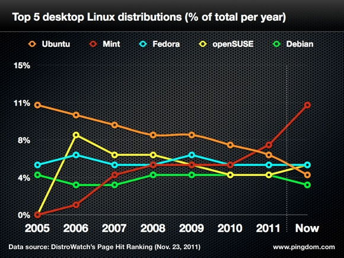
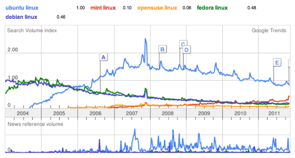

كشفت [دراسة](http://royal.pingdom.com/2011/11/23/ubuntu-linux-losing-popularity-fast-new-unity-interface-to-blame/) نشرتها pingdom معتمدة على إحصائيات موقع [distrowatch](http://distrowatch.com/) و خدمة Google trends أن شعبية Ubuntu في تراجع مستمر، حيث تحتل حاليا المركز الرابع في ترتيب شعبية توزيعات Linux، في حين رجعت الصدارة إلى توزيعة Linux Mint.

ويُرجَّح أن يكون لقرار Canonical الاعتماد على واجهة unity بالغ الأثر على هذا القرار، حيث عرفت توزيعة Mint زيادة في استعمالها [قُدِّرت بنسبة 40% خلال شهر واحد](http://blog.linuxmint.com/?paged=4)، وهو أمر راجع إلى "نزوح" مستخدمي Ubuntu الذين لم يعجبهم سطحا مكتب Unity و Gnome3.

و تؤكد نتائج البحث على Google أيضا هذا التراجع، حيث تظهر مقارنة اهتمام الباحثين على مختلف التوزيعات على [Google trends](http://www.google.com/trends?q=ubuntu+linux%2C+mint+linux%2C+opensuse+linux%2C+fedora+linux%2C+debian+linux&ctab=0&geo=all&date=all&sort=0) التراجع المتواصل لتوزيعة Ubuntu ومواصلة صعود Linux Mint. كما توضح هذه النتائج أيضا تراجعا متواصلا في شعبية توزيعتي Fedora و Debian، في حين يبقى الاهتمام بتوزيعة OpenSuse ثابتا إلى حد ما خلال السنوات الست الأخيرة.

من المتوقع أن تغير Canonical من سياستها التي تعتمد حاليا بشكل أساسي على Unity نظرا للأثر السلبي له، إلا أنها قد تخسر محبي هذه الواجهة إن هي تخلت عنها بشكل كامل. في المقابل ستضطر توزيعة Linux Mint إلى الانتقال بدورها إلى  Gnome 3 في الإصدار القادم (12) نظرا لتوقف دعم الإصدار 2.32 من Gnome، وهو ما جعل فريق عمل التوزيعة في حيرة من أمره، فنجده يحاول إيجاد حلول توافقية لتجنيب نفور مستخدمي الإصدار 2.32 من Gnome مثلما [نقرأه](http://blog.linuxmint.com/?p=1875) على المدونة الرسمية للتوزيعة.

تجدر الإشارة إلى أن توزيعة Mint مبنية أساسا على Ubuntu وتتميز عنها باحتوائها العديد من البرامج و codecs مغلقة المصدر. في المقابل توفر التوزيعة خيارين آخرين: الإصدار Universal مفتوح المصدر بشكل كامل الذي لا يحتوي أيا من هذه التطبيقات الإضافية، إضافة إلى إصدار آخر مبني على Debian.

في رأيك هل ستقرر Canonical التخلي عن Unity والرجوع إلى Gnome من جديد؟ وهل تتوقع نفور المستخدمين من توزيعة Mint بعد اعتمادها على Gnome3 في الإصدار القادم؟
