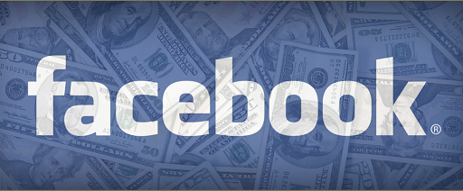

أشار موقع [Forbes](http://www.forbes.com/sites/greatspeculations/2011/11/27/facebook-could-go-public-before-christmas-valuation-a-big-question/)  إلى احتمال دخول Facebook البورصة قبل نهاية السنة الجارية، وهو ما يعتبر تأكيدا لما نشره موقع  [business insider](http://www.com/facebook-employees-go-nuts-as-zuckerberg-tells-them-the-ipo-is-coming-2011-11?op=1) منذ حوالي أسبوعين، والذي استند إلى معلومات من مصادر مقربة من موظفي الشبكة الاجتماعية.

ومن المنتظر أن يكون دخول Facebook إلى البورصة الأضخم بعد الذي قامت به Google، حيث تشير الكثير من التحليلات إلى احتمال وصول قيمة الشبكة إلى 100 مليار دولار، مما يجعلها أكبر قيمة من شركة Amazon. لكن في المقابل تشكك Forbes في هذه القيمة مستندة إلى [أرقام trefis](http://www.trefis.com/company?hm=FBOOK.trefis) التي تقدر قيمة Facebook بحوالي 45.1 مليار دولار فقط.

وقد كانت جميع المؤشرات تشير إلى احتمال تأخير دخول Facebook البورصة إلى غاية 2012، خاصة مع [الاضطرابات التي تعرفها البورصة](../2011/08/nasdaq-takes-sharp-fall/) والمشاكل التي تترتب على ذلك، فعلى سبيل المثال تراجع سعر سهم Groupon اليوم إلى غاية[ 16.85 دولار](http://chicagoist.com/2011/11/28/groupon_stock_shows_signs_of_losing.php) أي أن سعره الحالي أقل من سعره في أول يوم من تداوله المقدر بعشرين دولارا.

حتى وإن تأخر دخول Facebook إلى البورصة مرة أخرى، إلا أنه من الممكن تكوين صورة أوضح حول قيمتها الحقيقية  قبل شهر أبريل القادم، حيث يتوجب على الشبكة الكشف عن نتائجها المالية نظرا لتجاوز عدد المساهمين فيها حاجز الخمسمائة

في رأيك، هل ستفعلها Facebook وتدخل البورصة قبل نهاية السنة الجارية؟ وهل ستستفيد من ذلك؟ أم تتوقع أن يكون لها مصير مشابه لمصير Groupon؟
