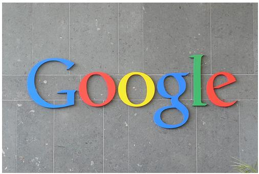
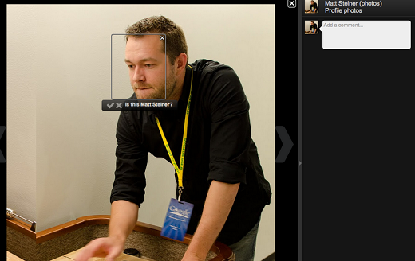
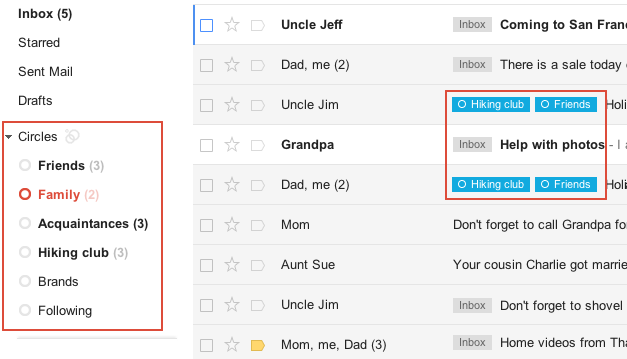
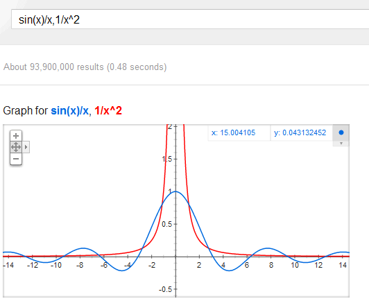

الأيام القليلة الماضية كانت حافلة جدا بأخبار Google بالعديد من المنتجات والتحديثات الجديدة والتي نلخص لكم أهمها في هذه الأسطر:

 

أطلقت Google تطبيق [Google Currents](http://www.google.com/producer/currents) الذي يتيح تحويل أي محتوى رقمي على شكل مجلة يسهل تصفحها على الهواتف الذكية والأجهزة اللوحية. تضع Google بين أيدي مستخدمي تطبيقها جملة مختارة من المحتويات [بشكل قياسي](http://www.google.com/producer/editions) مثل Forbes، CNETو AllThingsD.

<!-- more -->

<iframe src="http://www.youtube.com/embed/5LOcUkm8m9w" height="315" frameborder="0" width="560"></iframe>

كما أنه من الممكن تحويل أي محتوى إلى "مجلة" لتصفحه بشكل أفضل على الأجهزة اللوحية أو الهواتف الذكية. والصورة التالية توضح كيف تظهر أخبار المجلة التقنية بعد تحويلها إلى "مجلة" (يعني تصبح مجلة المجلة التقنية :p).

إطلاق خاصية [Find My Face](https://plus.google.com/101560853443212199687/posts/VV45vivcFq4) على خدمة Google+ والتي تتيح التعرف على الأشخاص مباشرة من خلال الصور، تماما مثل خاصية Facebook التي تقوم بنفس العملية. إلا أن Google وبخلاف Facebook لم تقم بتفعيل هذه الخاصية بشكل قياسي، حيث تركت الأمر اختياريا، وهذا يدل على أن Google تعلمت كثيرا من أخطائها وأخطاء غيرها فيما يتعلق بمسائل خصوصية الأفراد. ويعتبر إطلاق خاصية Find My Face نتيجة [لشراء Google شركة PittPatt](http://techcrunch.com/2011/07/22/google-acquires-facial-recognition-software-company-pittpatt/) المتخصصة في هذا المجال منذ أشهر خلت.

في حوار نشرته [جريدة Le Point](http://www.lepoint.fr/technologie/eric-schmidt-apple-veut-vous-empecher-d-avoir-le-choix-09-12-2011-1405776_58.php) الفرنسية، هاجم Eric Schmidt شركة Apple بضراوة، حيث صرح أنه يعتقد أن شركة التفاحة المقضومة تعيش حاليا في حالة خوف كبيرة وذلك في معرض حديثه عن قضية مهاجمتها لمنتجات Samsung ومحاولة إيقاف بيعها في أكثر من بلد. ويؤكد Schmidt أن Google ساعدت سابقا وستساعد شركاءها في حروبهم ضد Apple، وخص بالحديث HTC. كما اتهم Apple  بمحاولتها أن تفرض منتجاتها بالقضاء على أية منافسة.

بعد [3 سنوات من التطوير المتواصل](http://venturebeat.com/2011/12/08/google-nabs-square-enix-and-other-game-developers-to-do-native-chrome-games/)، أعلنت Google عن وصول تقنية Native Client التي تسمح بتنفيذ شفرة مكتوبة بلغات مختلفة مباشرة من خلال Chrome إلى مرحلة متقدمة من النضج تسمح مثلا بتشغيل عدة ألعاب "ثقيلة" كالتي توفر عادة على منصات الألعاب مباشرة من خلال Chrome، وتتوفر حاليا بعض الألعاب على متجر Chrome مثل [Bastion](https://chrome.google.com/webstore/detail/oohphhdkahjlioohbalmicpokoefkgid)، [Star Legends](https://chrome.google.com/webstore/detail/chcaflnbhnoegjedbjaamecefhglfamc) و [Wolf Toss](https://chrome.google.com/webstore/detail/pjlncddmdljpioccbmempchonhlifakc).

يعتبر هذا الأمر في غاية الأهمية لشركات الألعاب، حيث سيصبح بمقدورها الوصول إلى شريحة أوسع من المستخدمين، فمثلا يُوفر محرك الألعاب Unity 3D الذي يملك 90 مليون مستخدم خيار توفير نسخة خاصة بمتصفح Chrome بمجرد النقر على CheckBox خاص بذلك، فاتحا بذلك الباب أمام 200 مليون مستخدم لمتصفح Chrome.

<iframe src="http://www.youtube.com/embed/jCLKUWlOr2s" height="315" frameborder="0" width="560"></iframe>

على مدونة [Gmail الرسمية](http://gmailblog.blogspot.com/2011/12/gmail-and-contacts-get-better-with.html) أعلنت الشركة تضمين Google+ مباشرة داخل خدمة البريد، مما سيمكن من استعراض الرسائل حسب الدوائر التي ينتمي إلى المرسلون.

كما تعزم Google إضافة لمسة اجتماعية إضافية على خدمة Analytics وذلك بإطلاقها العام القادم لوحدة جديدة أطلقت عليها اسم [socialhub](http://www.google.com/analytics/developers/socialhub.html) .

وفي الأخير، قامت Google بإدخال تطويرات إضافية على محرك بحثها ليمكن مستخدمين من رسم [منحنيات الدوال الرياضية بمجرد كتابتها في خانة البحث](http://googlesystem.blogspot.com/2011/12/googles-graphing-calculator.html).

الصورة التالية توضح المنحنى البياني لدالتي: sin(x)/x و 1/x^2

