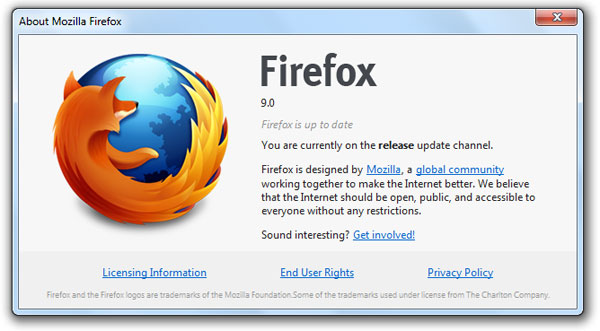

أطلقت Mozilla اليوم الإصدار 9 من متصفح Firefox، وبذلك يصل عدد الإصدارات الرئيسية للمتصفح التي أُطلقت هذا العام إلى 6.

أهم ما جاء به هذا الإصدار هو تسريع SpiderMonkey محرك JavaScript الخاص بالمتصفح، حيث أنه وبفضل تزويده بخاصية [Type inference](http://blog.mozilla.com/futurereleases/2011/11/10/type-inference-to-firefox-beta/) أصبح بإمكان المتصفح معالجة شفرات JavaScript أسرع بحوالي 30% مما كان عليه الحال سابقا.
كما يعرف هذا الإصدار دعما أفضل للعديد من مزايا HTML5، CSS3 و MathML إلى جانب إمكانية التحقق من وضعية خاصية [Do Not Track](https://www.it-scoop.com/2011/01/mozilla-do-not-track/) من خلال JavaScript، فضلا عن ترقيع [جملة من العلل](http://www.mozilla.org/en-US/firefox/9.0/releasenotes/buglist.html).
ولقد عرف إصدار المتصفح الخاص بنظام Mac OS X (الإصدار Lion)  تحديثات أخرى، كتحسينات في الواجهة الرسومية ودعم أفضل للتصفح باستعمال إصبعين.

تجدر الإشارة إلى أن متصفح Firefox قد [خسر مركزه الثاني](https://www.it-scoop.com/2011/11/chrome-matches-firefox-market-share/) في ترتيب Net Applications لأكثر المتصفحات استعمالا لصالح Chrome خلال  الشهر الماضي، كما أن المتصفح يعاني من مُعضلة أخرى تتمثل في النسبة الكبيرة التي لا يزال يحوز عليها الإصدار 3.6 من المتصفح والتي تُقدر بحوالي [5.54%](http://gs.statcounter.com/#browser_version-ww-monthly-201011-201111) (من أصل 25.31% للمتصفح بجميع إصداراته).
Firefox 9 متوفر للتحميل من [هنا](http://www.mozilla.org/en-US/firefox/all.html). أما قائمة كافة التحسينات (Release Notes) فهي متوفرة من [هنا](http://www.mozilla.org/en-US/firefox/9.0/releasenotes/).
