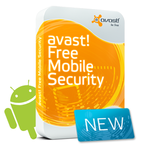

أطلقت Avast مضاد الفيروسات avast! Free Mobile Security لنظام Android  بشكل مجاني، يقوم بحماية الأجهزة من البرامج الضارة ويتميز بعدة خواص إضافية تصلح في حال تعرض الجهاز للسرقة.

من بين الخواص "الذكية" لهذا البرنامج قدرته على التمويه، حيث يسمح بتغيير أيقونة التطبيق واسمه، وهي خاصية مفيدة جدا في حال سرقة الجهاز، حيث أنه لن يتمكن السارق (الذي يلعب القردُ دوره في الفيديو الدعائية للتطبيق) من معرفة ما إذا كان الهاتف مجهزا به.

لن تكون هذه الخاصية ذات فائدة إذا لم تُقرن بخواص أخرى، حيث يمكن الجهاز من معرفة الرقم الجديد في حال تم تغيير الشريحة، معرفة الموقع الجغرافي للجهاز، "التجسس" على السارق، وحتى تحويل المكالمات والرسائل القصيرة إلى رقم آخر. أما أهم خاصية فهي إمكانية محو كامل محتوى الجهاز عن بعد.

avast! Free Mobile Security متوفر للتحميل المجاني على Android Market على [هذه الصفحة](https://market.android.com/details?id=com.avast.android.mobilesecurity). ولمعرفة المزيد عنه زوروا [صفحته الرسمية](http://www.avast.com/free-mobile-security).

الفيديو الترويجية لتطبيق avast! Free Mobile Security:

<!-- more -->

<iframe src="http://www.youtube.com/embed/sVzou1P68I8" height="315" frameborder="0" width="560"></iframe>
