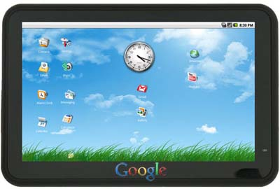

كما [أخبرناكم سابقا](https://www.it-scoop.com/2011/12/google-android-tablet/)، فلقد سبق وأن أعلن Eric Schmidt عن تخطيط Google لإطلاق جهازها اللوحي خلال النصف الأول من العام القادم. قد يبدو الأمر إيجابيا خاصة لمحبي نظام Android، لكن هل سيؤثر ذلك سلبا على سوق الأجهزة اللوحية المجهزة بنظام Android؟

الجواب قد يكون بالإيجاب مثلما يشير إليه موقع [Digitimes](http://www.digitimes.com/news/a20111226PD204.html)، ويعود الأمر إلى أن جهاز Google اللوحي سيكون مجهزا بالإصدار 4.1 من نظام Android، وهو ما يخلط حسابات المصنعين الذين ينوون توفير أجهزة لوحية خلال نفس الفترة تكون مجهزة بالإصدار 4.0 من النظام.

وهو الوضع الذي سيرجح الكفة لصالح Google، حيث أنه من الطبيعي أن يرغب المستخدمون في الحصول على جهازها اللوحي ليس فقط لأنها مالكة Android فحسب لكن أيضا للاستفادة من أحدث إصدار من النظام بدل انتظار أن "يحن" المصنعون عليهم لتوفير تحديث جديد لهم.

لم يتضح بعد النظام الذي ستعتمده Google لتصنيع جهازها اللوحي، حيث يتوقع بعض المحللون أن تكرر Google تجربتها مع الهواتف في تصنيعها لجهازها اللوحي وذلك بالاعتماد على أحد شركائها لتصنيع الجهاز وهو نظام آتى ثماره. في حين يرجح آخرون أن تفضل Google هذه المرة الاعتماد على خبرة وتجربة Motorola في هذا الميدان والتي سبق لها وأن [اشترتها سابقا](https://www.it-scoop.com/2011/08/google-motorola-mobility/) مقابل 12.5 مليار دولار، رغم أن جهازيها اللوحيين Xoom و Xoom2 لم يحققا نجاحا كبيرا.

في رأيك هل سيعزف المصنعون على اعتماد نظام Android في أجهزتهم بدل دخول Google إلى سباق الأجهزة اللوحية؟

