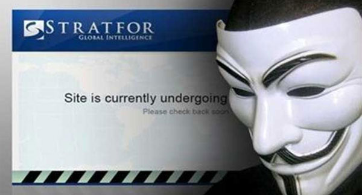

تعرض موقع  [Stratfor](http://www.stratfor.com/) (وهي شركة أبحاث في الولايات المتحدة الأمريكية تقدم معلومات استخباراتية حول الكثير من المجالات حول العالم مثل الأعمال، الاقتصاد، الأمن والعلاقات السياسية)[ للاختراق](http://venturebeat.com/2011/12/30/stratfor-data-dump/) على يد قراصنة تمكنوا من سرقة قاعدة البيانات ونشر أسماء الكثير من المشتركين لديهم للعلن، هذا وقد أعلنت مجموعة Anonymous الناشطة عبر الانترنت مسؤوليتها عن الاختراق.

وفي لقاء حصري مع المخترق الذي قام بتقديم المعلومات التي حصل عليها لـ [AntiSec](http://en.wikipedia.org/wiki/Antisec_Movement) أحد فروع Anonymous، حصلنا على المعلومات التالية:

المجلة التقنية: ما الثغرة التي قمت باستخدامها؟

<undisclosed-attacker>:

 mysql –u root –h IP_ADDRESS

 مستخدم root بدون كلمة سر!

في الواقع لقد تم الأمر بمحض الصدفة. الجهاز الذي قمت باختراقه لم يكن يحوي على شئ سوى mysql بصلاحيات قراءة وكتابة. قمت بالبحث فيه فتوصلت إلى بيانات حساب mysql آخر مكنني من اختراق مخدم موقع STRATFOR. قمت بعدها بإعطاء AntiSec بيانات الدخول وتولّوا الباقي.

المجلة التقنية: ما الذي دفعك للذهاب خلف هذه الشركة؟

<undisclosed-attacker>: نعم، إن مثل هذه الشركات لا تتوقع أن يتم اختراقها. إن STRATFOR مثل صحيفة يقرؤها مخنثو الجيش :P

<undisclosed-attacker>: إن STRATFOR وغيرها أهداف رائعة للحصول على معلومات استخباراتية قيمة. في قائمة المشتركين الخاصة بهم على سبيل المثال، لا تهتم بأسماء الشركات.. ولكن ابحث عن المواقع الجغرافية لعناوينها في Google Maps مثلاً وستحدد الجواسيس :P

<undisclosed-attacker>: على الأقل في الدولة التي أعيش فيها، تستطيع أن تلاحظ بسهولة أن هذه العناوين هي عناوين مناطق أمنية، وستعلم بأن الشخص الذي يعمل هناك هو عميل مخابرات.

وحسب [Identity Finder](http://www.identityfinder.com/blog/post/Identity-Finder-Releases-Detailed-Analysis-of-Personal-Information-e28098Anonymouse28099-Attack-on-Stratfor.aspx)، فإن هذه العملية أسفرت عن الكشف عن بيانات أزيد من 50 ألف بطاقة ائتمانية، من بينها 9651 بطاقة لم تنته مدة صلاحيتها بعد، إلى جانب 86 ألف عنوان بريد الكتروني، 27 ألف رقم هاتف إضافة إلى 44 ألف كلمة مرور مشفرة قرابة نصفها قابل للكسر بسهولة.

بالرغم من ذلك فإن العملية يشوبها الكثير من الغموض، حيث نُشر بيان صحفي على [موقع pastebin](http://pastebin.com/8yrwyNkt) تتبرأ فيه المجموعة من العملية، وهو ما يعيد إلى الأذهان العمليات السابقة التي تمت باسم Anonymous ويطرح التساؤل إن كانت مجموعات منشقة عن هذا الفيلق هي من قامت بها، أو مجموعات تود تشويه صورتها.

ولقد تم توزيع أموال معتبرة من بطاقات الإئتمان المسروقة، وهو ما يضع المؤسسات الخيرية التي استقبلتها في وضع محرج، مثلما [يشير إليه](http://www.f-secure.com/weblog/archives/00002288.html) Mikko Hypponen  من f-secure، حيث سيطالب أصحاب هذه الحسابات باسترجاع أموالهم التي لم يهبوها عن طيب خواطرهم،مما قد يُعرض هذه المنظمات لعقوبات.
