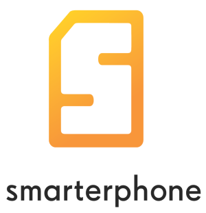

قامت Nokia بشراء الشركة النرويجية Smarterphone التي تنتج نظام تشغيل يحمل نفس الاسم خاص بالهواتف المحمولة العادية والتي تعرف عادة تحت اسم Feature Phones (لتمييزها عن الهواتف الذكية Smart Phones).

يتميز نظام Smarterphone بمواصفات تقرِّب هواتف Feature Phones من نظيراتها "الذكية"، ويتيح عدة خواص مثل محرك لتنفيذ Java ME، إمكانية تغيير قوالب الهاتف (theme switching)، دعم Wi-fi و Bluetooth، دعم للشبكات الاجتماعية، و[غيرها من الخواص](http://www.smarterphone.com/products.php).

حسب الصندوق الاستثماري Ferd Capital الذي كشف عن الأمر [ليلة أمس](http://www.ferd.no/lang/en/show.do?page=12;22&articleid=2456)، فإن العملية قد تمت شهر نوفمبر الماضي دون أن يتم الكشف عن التفاصيل المالية للصفقة. إلا أن الصندوق الاستثماري قد أشار إلى استثماره 6.5 مليون يورو في الشركة منذ سنة 2007.

يأتي ذلك بُعيد الأنباء التي تداولت أمس عن [إمكانية بيع Nokia لقسمها الخاص بالهواتف الذكية لـ Microsoft](https://www.it-scoop.com/2012/01/microsoft-nokia-smartphone-division-unit/) وتركيزها على الهواتف العادية فقط Feature Phones وهو ما قد يعطي المصداقية لهذا الخبر (لماذا لم يتم الإعلان من قبل عن عملية البيع، وتُركت "نائمة" لحوالي شهرين؟).

لكن السؤال الذي يطرح نفسه الآن هو هل ستتخلى Nokia عن استخدام نظام Symbian  وواجهة S60 لصالح نظام Smarterphone، أم أنها ستعتمد عليه لإنهاء العمل على [نظامها الجديد Meltemi المبني على نظام Linux](http://online.wsj.com/article/SB10001424052970203405504576599011587667984.html)؟
