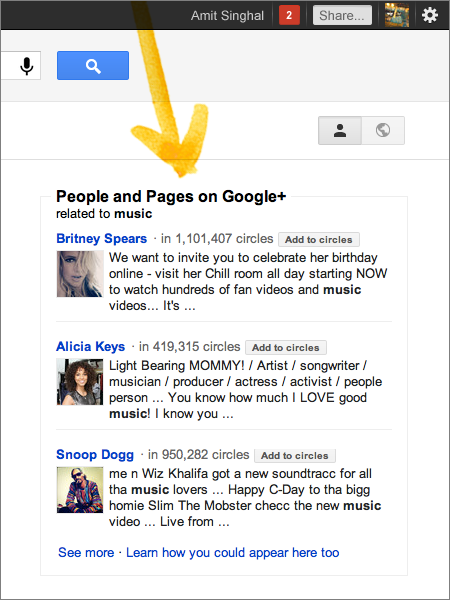

في [تدوينة جديدة](http://googleblog.blogspot.com/2012/01/search-plus-your-world.html) على مدوّنتها الرّسميّة، كشفت Google عن طبقة جديدة تضيفها إلى محرّك بحثها المسيطر على السّوق في محاولة منها للتّوسّع في العالم الاجتماعيّ وتحسين نتائج البحث لتكون أكثر شخصيّة وعمليّة.

<blockquote>نعمل على تحويل Google إلى محرّك بحث لا يفهم المحتوى فحسب، بل الأشخاص والعلاقات بينهم أيضًا، بدأنا هذا التّحويل [بالبحث الاجتماعيّ](http://googleblog.blogspot.com/2009/10/introducing-google-social-search-i.html)، واليوم نكمله...</blockquote>

الطّبقة الجديدة الّتي سمّتها الشّركة ضمن التّدوينة Your World تتألّف من ثلاثة عناصر:

	  * نتائج البحث الشّخصيّة: تسمح بالعثور على معلومات خاصّة بالمستخدم الّذي يقوم بعمليّة البحث كمنشورات وصور Google+ الّتي نشرها المستخدم أو شُوركت معه. فإذا بحثت عن صور لمدينتك فستجد ضمن النّتائج صورًا نشرتها على حسابك مثلاً أو صورًا شاركها أصدقائك معك.

الملفّات الشّخصيّة في البحث: ستظهر الملفّات الشّخصيّة في قائمة الإكمال التّلقائي لمدخل البحث وفي نتائج البحث أيضًا، وتضمن الأشخاص الّذين تعرفهم أو قد ترغب بإضافتهم على Google+ (في حال كان لديك حساب على الشّبكة).

النّاس والصّفحات: وتختلف عن السّابقة بكونها تظهر كنتيجة بحث عن موضوع معيّن، فالبحث عن ما يتعلّق بالرّياضة سيظهر الملفّات الشّخصيّة لرياضيّين مشهورين وصفحات تنشر أخبار رياضيّة مثلًا على Google+، وسيكون بإمكانك بالطّبع إضافتهم من صفحة البحث عبر زرّ الإضافة إلى الدّوائر.

**الخصوصيّة والحماية**

تتابع الشّركة الحديث عن ميّزات هذه الطّبقة لتتطرّق لموضوع الخصوصيّة والأمان، فصفحات نتائج البحث مع هذه الطّبقة مشفّرة بتشفير SSL لتحميك من تجسس أطراف ثالثة على محتواها. كذلك سيكون بإمكانك الانتقال إلى البحث التّقليديّ بكبسة زرّ، وضبط الإعداد الافتراضي أيضًا.

رأيي أنّ هذه الإضافات برأيي خطوة جديدة لدمج Google+ مع بقيّة منتجات الشّركة بحيث تصبح طبقة اجتماعيّة أكثر من كونها شبكة، وهذا ما أكّدت عليه Google في السّابق، تقول الشّركة إنّ هذه هي البداية، ولا ننسَ تصريحًا سابقًا من أحد مسؤوليها بأنّهم "أضافوا +، وبقي Google". بهذه الإضافات تنافس Google العلاقة بين Facebook وBing وتجعل نتائج البحث اجتماعيّة أكثر وأقرب إلى احتياجات المستخدم، لكنّها أيضًا قد تحصره في عالمه الخاصّ وتغيّبه عن أخبار ما يحدث خارجه!

الفيديو التعريفية بالتحديثات الجديدة:

<!-- more -->

<iframe src="http://www.youtube.com/embed/8Z9TTBxarbs" height="315" frameborder="0" width="560"></iframe>
