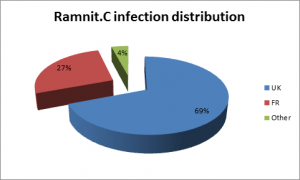
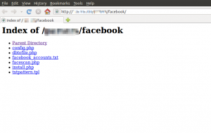

على الرغم من قدمها، إلا أن استمرار انتشار أشكال مختلفة منها جعلها تستحوذ على ما يقارب 17.3% من نسبة الإصابات ببرمجيات خبيثة جديدة وذلك في [تقرير](http://www.symanteccloud.com/mlireport/SYMCINT_2011_07_July_FINAL-EN.pdf)أعدته Symantec في يوليو الماضي. حاليا، تعود دودة Ramnit من جديد بشكل آخر مستهدفة أحد أهم مواقع الشبكات الاجتماعية، موقع Facebook.

يقوم هذا الإصدار من دودة Ramnit بسرقة أسماء وكلمات المرور لحسابات مستخدمي Facebook، حيث تم اكتشاف مخدم تحكم Command & Control server  يحتوي على ما يقارب من 45000 حساب Facebook، معظمهم من فرنسا و بريطانيا وذلك في [تقرير](http://blog.seculert.com/2012/01/ramnit-goes-social.html) نشره باحثون من Seculert.

على ما يبدو، فإن القائمين خلف هذه النسخة من Ramnit يقومون بدخول الحسابات المسروقة ويعملون على نشرها مجدداً من خلال هذه الحسابات إلى أصدقائهم وعائلاتهم.

تعمل Ramnit على إصابة الملفات التنفيذية وملفات HTML وملفات Office، وتقوم بسرقة الأسماء وكلمات المرور وبيانات الـ cookies ويمكنها أيضاً أن تعمل كـ backdoor يسمح للقراصنة بتنفيذ نشاطات خبيثة أخرى باستخدام الجهاز المصاب.

هل استهداف مستخدمي الشبكات الاجتماعية هو "الموضة" الرائجة الآن؟ ما الخطر الذي قد يمثله هذا النوع من الهجوم برأيك؟
