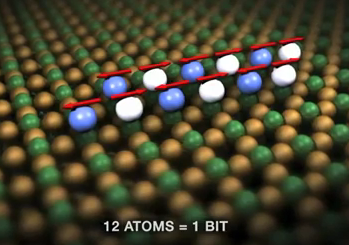

قد يبدو الأمر غريبا، أو بدون معنى، خاصة إن كنت بعيدا كل البعد عن مجال حفظ البيانات، أو أنك لم تفكر سابقا في المساحة الكافية لتخزين الملفات التي تستعملها، ربما لأنك تملك مفتح USB صغير جدا ويحمل ملفات كبيرة جدا، لكن ما توصلت إليه IBM من شأنه أن يجعل من المساحة اللازمة لتخزين نفس البيانات أصغر بكثير.

فقد [أعلنت](http://www-03.ibm.com/press/us/en/pressrelease/36473.wss) Big Blue عن توصلها إلى كتابة [Bit](http://en.wikipedia.org/wiki/Bit) واحد (أصغر وحدة تخزينية والتي تقبل قيمتين فقط: الصفر والواحد) باستخدام 12 ذرة فقط، بدل المليون ذرة المستخدمة حاليا لكتابة نفس المعلومة. وسيصبح من الممكن تخزين ما بين 100 و 150 Tb من البيانات في نفس الحجم الذي يسمح حاليا بتخزين 1 Tb.

لكن ما الذي قامت به IBM فعليا؟ حاليا يتم استخدام مواد مغناطيسية لصناعة الأقراص المضغوطة تجبر الذرات على التوجه في نفس الاتجاه إضافة إلى ترك مسافات معتبرة بينها، وما قامت به IBM هو استخدام طريقة جديدة من المغنطة يطلق عليها اسم [antiferromagnetism](http://en.wikipedia.org/wiki/Antiferromagnetism) والتي تسمح بتجاوز هذه الحدود، وهو ما يمكن من إنشاء وحدات تخزين بعدد أقل من الذرات وباستخدام مساحة أقل.

العملية لا تزال في بداياتها، حيث تتوقع IBM أن تصدر أولى المنتجات التي تعتمد على هذه التقنية بعد عقد من الزمن.

الفيديو التعريفية بالتقنية الجديدة المطورة من طرف IBM:

<!-- more -->

<iframe src="http://www.youtube.com/embed/hpKMShooDBo?rel=0" height="315" frameborder="0" width="560"></iframe>
