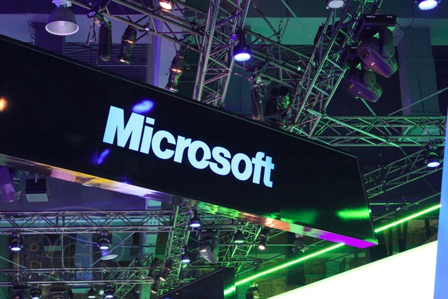

أعلنت Microsoft يوم أمس عن [نتائجها المالية](http://www.microsoft.com/investor/EarningsAndFinancials/Earnings/PressReleaseAndWebcast/fy12/Q2/default.aspx) للفصل الرابع من العام الماضي، والمفاجئة كانت تراجع أنظمة Windows إلى المرتبة الثالثة في ترتيب المداخيل، بعد أن كان يحتل إحدى المرتبتين الأولتين على مر تاريخ الشركة.

ولقد سبق لأنظمة Windows التراجع إلى المركز الثاني خلال الفصل الثالث من العام الماضي، قبل أن يتراجع من جديد خلال الفصل الأخير من نفس العام. وهو ما قد ينذر ببداية عصر جديد يلي عصر الحواسيب الشخصية وهو عصر يتوقع الكثيرون أن يحل محله عصر الأجهزة اللوحية.

لم تسجل مبيعات Windows سوى 4.74 مليار دولار، ويعود الأمر [حسب](http://www.telegraph.co.uk/finance/newsbysector/mediatechnologyandtelecoms/9026768/Microsoft-profits-beat-forecasts-on-business-demand.html) Sunit Gogia إلى الضعف والتراجع التي تشهده مبيعات الحواسيب الشخصية. وقد سبقتها كل من مداخيل قسم Microsoft Business  الذي سجل 6.28 مليار دولار ويعود الفضل في ذلك بشكل رئيسي إلى حزمة Office المكتبية، و قسم Server & Tools business الذي سجل 4.77 مليار دولار. أما قسم Entertainment & Devices فقد حل رابعا مسجلا مداخيل وصلت إلى 4.24 مليار دولار.

رغم ذلك فإن مجمل مداخيل Microsoft المقدرة بـ 20.89 مليار دولار سجلت تقدما بنسبة 5% مقارنة بنفس الفترة من العام الماضي. كما أنه تم بيع 525 مليون رخصة Windows 7 منذ إطلاقه. وسجل قسم Server & Tools business تقدما بنسبة 11%.
