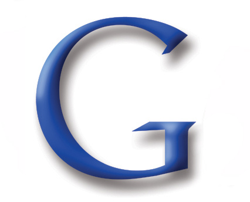
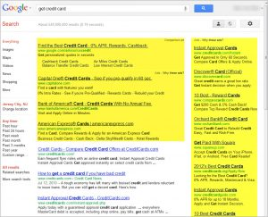

أعلنت Google على مدونتها الخاصة بمطوري المواقع عن [تحديث جديد](http://googlewebmastercentral.blogspot.com/2012/01/page-layout-algorithm-improvement.html) يهدف إلى الحد من كثرة الإعلانات التي يتوجب على الزوار المرور عليها قبل الوصول إلى المحتوى المبحوث عنه.

التحديث الجديد يستهدف المواقع التي تظهر الكثير من الإعلانات في المنطقة المسماة above the fold، وهي المنطقة العلوية التي تظهر من المواقع لدى زيارتها (المنطقة التي تظهر من دون اللجوء إلى استخدام scroll الفأرة لإظهار البقية). حيث أن هذه المنطقة تعرف نسبة نقر أعلى مما سواها، وهو ما يجعلها هدفا مفضلا للمعلنين.

ويقلل Matt Cutts من "خطورة" التعديل، حيث أنه لن يمس سوى 1% من نتائج البحث، لكنه في المقابل يطلب من أصحاب المواقع التركيز على المحتوى أكثر والتقليل من الإعلانات التي تظهر في هذه المنطقة. كما أنه يشير إلى أن هذا التحديث ما هو إلا واحد من بين 500 تحديث تنوي Google إدخالها على محرك بحثها خلال هذا العام.

لكن هناك [نقاط أغفلتها Google](http://www.ghacks.net/2012/01/20/to-many-ads-above-the-fold-are-bad-says-google/) في هذا الإعلان (قد يكون الأمر مقصودا) حيث أنها لم تفصح عن النسبة المسموح بها من الإعلانات في المنطقة المعنية (above the fold)، مما يفتح الباب من جديد أمام التكهنات والتجارب، والتي قد تطول قبل أن يصل المجربون إلى نتيجة، وذلك  لحاجة محركات الأرشفة Googlebot لعدة أسابيع قبل إعادة أرشفة جميع صفحات المواقع المعنية بالتحديث من جديد. كما أنها أغفلت الحديث عن أنواع الإعلانات المقصودة، ودقة الشاشة المعتمدة في قياس المساحة المستهدفة

كما أن هذا التغيير قد يسبب لها أيضا "وجع رأس" جديد، فمن المتوقع أن تحظى إعلانات AdSense التي تظهر في محرك بحثها بالكثير من الانتقادات، حيث أنه في العديد من الحالات تحتل هذه الإعلانات مساحة معتبرة من منطقة above the fold. مما يعني أن Google أمام خيارين، إما التقليل من هذه الإعلانات، أو [معاقبة نفسها من جديد مثلما فعلته سابقا مع Chrome](https://www.it-scoop.com/2012/01/chrome-page-pagerank-reduced/).

يمكن معرفة المزيد حول الموضوع بقراءة الموضوع التالي على موقع Search Engine Land:

[Pages With Too Many Ads “Above The Fold” Now Penalized By Google’s “Page Layout” Algorithm](http://searchengineland.com/too-many-ads-above-the-fold-now-penalized-by-googles-page-layout-algo-108613)

للتذكير فإن Google أدخلت العديد من التحسينات على محرك بحثها خلال الأشهر القليلة الماضية، أحدثها كانت [تزويد محرك البحث بالخواص الاجتماعية لطبقتها الاجتماعية Google+](https://www.it-scoop.com/2012/01/google-makes-its-search-more-social/)، إضافة إلى جملة متكونة من [30 تحديثا مختلفا](https://www.it-scoop.com/2012/01/google-30-search-quality-changes%e2%80%8e/) تم الكشف عنها بداية الشهر الجاري.
