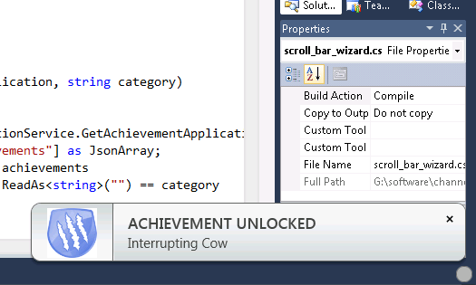
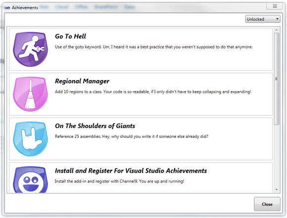

تخيل وأنت تبرمج وفي قمة التركيز، وإذا بشارة على أسفل يمين الشاشة تقول لك Go to hell،.. مالخطب؟؟ ... آه استعملت تعليمة  Goto سيئة الذكر (عافنا الله وإياك من جحيمه)، وربما كنت شريرا واستعملت طريقة ماكرة في البرمجة فيقول لك Don't try this at home! ، هذا وغيره من الفكاهة، ما أضافته قناة [Channel9](http://channel9.msdn.com/) التابعة لـ Microsoft على بيئة التطوير Visual Studio 2010 (إن كنت لا تعرف ماهي Channel9 أنصحك بقراءة [مقال الأخ رؤوف شبايك](http://www.shabayek.com/blog/2011/12/11/%D9%85%D8%A7-%D8%A8%D9%8A%D9%86-%D8%AC%D8%AD%D9%8A%D9%85-%D8%AF%D9%84-%D9%88-%D8%A7%D9%84%D9%82%D9%86%D8%A7%D8%A9-%D8%A7%D9%84%D8%AA%D8%A7%D8%B3%D8%B9%D8%A9/)) .

الفكرة جاءت من عالم الألعاب وخاصة XBox، حيث لكل لاعب أوسمة يفتكها حسب مهارته، [لتلد فكرة Visual Studio Achievements](http://channel9.msdn.com/Blogs/C9Team/Announcing-Visual-Studio-Achievements) ، وهي عبارة عن إضافة plug-in ، تقوم بعد تثبيتها بإنشاء خيط معالجة صامت Background thread، وظيفته الإنصات لأحداث أو حركات معينة في بيئة العمل، وفي كل مرة تقوم بعمل تجميع Compile للكود الذي كتبته تقوم الإضافة بتحليل الـ Thread فإن اكتشفت فيه بعضا من المعايير اللازمة، تُحفزّ رسالة إنذار وتسم المبرمج بالوسام المناسب، هذا الأخير يتم عرضه على العموم في ملفه الشخصي على موقع القناة التاسعة Channel9. وطبعا يمكن للمبرمج بعدها نشر وسامه الذي افتكه على الشبكات الاجتماعية.

الأوسمة مقسمة إلى 6 تصنيفات:

	  * Customizing Visual Studio
	  * Don't Try This At Home
	  * Good Housekeeping
	  * Just For Fun
	  * Power Coder
	  * و Unleashing Visual Studio،

توزع حسب 32 إنجاز يقوم به المطور، نذكر على سبيل المثال:

	  * استعمال أكثر من 6 مناطق Region في صنف Class واحد يُعطي وسام Regional Manager :)
	  * 5 تعليمات معالج Processor directives تعطيك Close To The Metal
	  * أكثر من 6 نقاط مقاطعة Breakpoints تعطيك Interrupting Cow

وهكذا دواليك ...

للتذكير، فإن الإضافة لا تزال في طور Beta لكن يمكن تحميلها والإستمتاع بها [من هنا](http://channel9.msdn.com/achievements/visualstudio).

- ما رأيك عزيزي القارئ في إضافة شيء من الفكاهة على بيئة التطوير؟ وهل ستثبتها؟

- أم أنك ممن تراها مضيعة لوقت المبرمج؟

حلل وناقش، قد تكسب معنا وسام it-scoop power commenter :)
