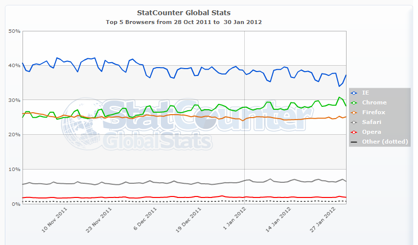
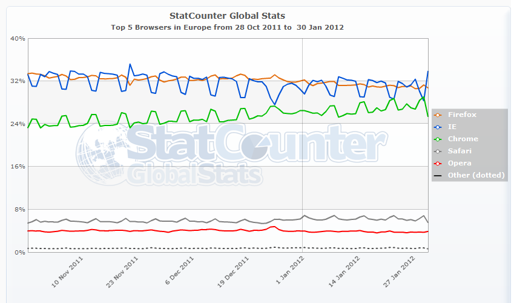

لو أمعنا النظر في [إحصائيات Statcounter](http://gs.statcounter.com/#browser-ww-daily-20111028-20120130) خلال الفترة الماضية، فإننا لا نلحظ فقط [تجاوز Chrome لمتصفح Firefox](https://www.it-scoop.com/2011/11/chrome-matches-firefox-market-share/) ولكن هناك اتجاه آخر يمكن أن نلحظه على المتصفحات، حيث أن استعمال Internet Explorer يزيد خلال أيام العمل، ويقل خلال عطل نهايات الأسابيع ليفسح المجال أمام Chrome لترتفع نسبة استخدامه أكثر.

ويظهر الأمر بشكل أوضح لدى قراءة إحصائيات القارة العجوز لوحدها، حيث تقترب حصة Chrome من حصة Internet Explorer بشكل واضح جدا، بل وتتجاوزها في العديد من الحالات. في حين لا يحدث أي تغيير فيما يخص باقي المتغيرات.

 

هل يُعتبر متصفح Internet Explorer أنسب من غيره لبيئات العمل؟ أم أنه يفرض فرضا من طرف الشركات وهو ما يجعل الموظفين "يهربون" إلى Chrome في عطل نهايات الأسبوع؟ وهل للألعاب المتوفرة مباشرة من خلال المتصفح دور في هذه الزيادة؟ ما رأيك أنت؟
