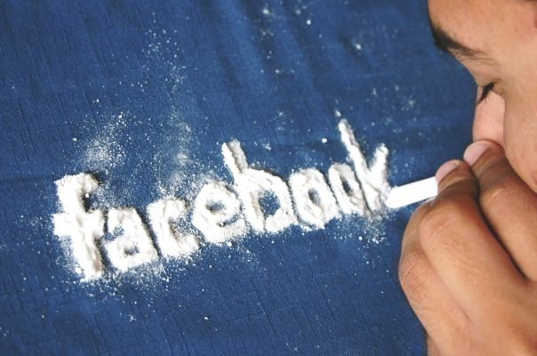

لعلّ الخبر الأهم المتعلق بالشبكات الاجتماعية هذه الأيام هو دخول Facebook إلى الاكتتاب العامّ. ومع هذه الإحصائيّة الّتي قامت بها شركة Hitwise، يظهر أن [التّعديلات](https://www.it-scoop.com/2011/09/facebook-google-plus/) الّتي أدخلها Facebook خلال العام الماضي على نسخة ويب مثل Ticker وTop Stories وغيرها نجحت في الحفاظ على قاعدة المستخدمين الواسعة التي تعني بطبيعة الحال زيادة أرباح الشّركة.

الدّراسة تتركّز في الولايات المتّحدة، وأهم ما ورد فيها:

	  1. في كل 11 زيارة للإنترنت (جلسة) في الولايات المتّحدة، يُزار موقع Facebook.com مرّة واحدة. أي 9% تقريبًا.
	  2. في كل 5 صفحات تزار على الإنترنت في الولايات المتّحدة، يكون Facebook.com إحداها. أي 20% من الصّفحات.
	  3. المعدل الوسطي لتصفّح Facebook ضمن الجلسة الواحدة في الولايات المتّحدة هو 20 دقيقة.
	  4. 57% من زوّار Facebook.com خلال 12 أسبوعًا المنتهية في 28 يناير كنّ إناثاً.
	  5. "Facebook" هو مصطلح البحث الأكثر استخدامًا في الولايات المتّحدة، والمصطلحات المتعلقة بـFacebook تمثّل حوالي 14% من نتائج البحث الخمسين ألفًا الأكثر نقرًا (خلال 12 أسبوعًا المنتهية في 28 يناير).
	  6. ولاء المستخدمين للشبكة عالٍ جدًّا، إذا أنّ 4% فقط من زوّار Facebook.com خلال شهر يناير كانوا زوّارًا جددًا.

هذا كان أهم ما ورد في الدّراسة، يمكنك الاطّلاع على بقيّة الإحصائيًّات على [موقع Hitwise](http://weblogs.hitwise.com/heather-dougherty/2012/02/10_key_statistics_about_facebo_1.html).

تتنهي الدراسة بذكر أن Facebook هو الموقع الأكبر في الولايات المتّحدة ويتمتّع بقاعدة مستخدمين مخلصة وتُمضي وقتًا لا بأس به على الموقع وأنّ تأثير الموقع يُرى في الانتخابات الرّئاسيّة و عادات التّسوّق الإلكترونيّ وغيرها.

هل سيسكت عملاق الويب Google عن هذا؟ هل يحضّر شيئًا في الخفاء؟ أم هي [الحرب](https://www.it-scoop.com/2011/11/facebook-google-fight/) الباردة؟ وربّما السؤال الأهمّ: هل يقضي Facebook على فضاء الإنترنت الحرّ الواسع دون انتباهنا؟
