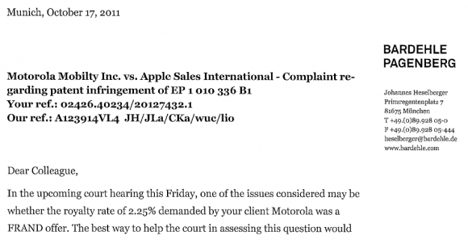

في تطور مذهل للأحداث بين Motorola و Apple، طالبت الأولى الثانيةَ بنسبة 2.25 % من أرباح مبيعات iPhone و iPad (نسخ 3G) التي -حسب آخر [قرار للمحكمة الألمانية](http://fosspatents.blogspot.com/2012/02/motorola-is-suing-official-german-apple.html)- تتعدى على براءات اختراع Motorola في مجال الاتصالات والجيل الثالث. هذه الأخيرة وصفت النسبة التي تُطالب بها عادلة، معقولة وغير تمييزية  (fair, reasonable, and non-discriminatory) أو كما تعرف اختصارا بقاعدة FRAND.

من جهتما ترى Apple أن النسبة التي تُطالب بها Motorola مبالغ فيها وأنها لم تلتزم بقوانين FRAND التي تنص على وجوب أن تكون النسبة عقلانية، وهو اعتراف ضمني بأنها استعملت براءات اختراع Motorola بدون ترخيص. كما أنها تقوم حاليا بالبحث لمعرفة المُقابل الذي تدفعه شركات مماثلة مقابل استغلال نفس براءات الاختراع، وذلك لتُطالب بتطبيق نسبة مماثلة بها.

ويعتقد Florian Mueller (الذي استشهد به موقع Go Android) المتخصص في نزاعات براءات الاختراع والذي [كشف تفاصيل هذا الخبر](http://fosspatents.blogspot.com/2012/02/motorola-wants-225-of-apples-sales-in.html)، بأنه لو ثبتت المحكمة طلب Motorola  ودفعت Apple ما عليها فإن هذا الأمر سيكون له تأثير سلبي على سوق مبيعات Apple حيث أن مثل هذه النسبة ستسبب ارتفاعا في أسعار iPhone و iPad بينما سيعود على مدللة Google الجديدة بأرباح كبيرة خاصة وأن iPhone  و iPad تُعد من أكثر الأجهزة مبيعا ليس فقط لشركة Apple بل في العالم أجمع.

لكن وعلى النقيض تماما لو ثبت أن مزاعم Apple حول النسبة المبالغ فيها صحيحة، فلن تنجو Apple بجلدتها فحسب بل ستسبب مشاكل أكبر لشركة Motorola مع لجنة مكافحة الاحتكار الأوروبي، مثلما يُشير إليه موقع [Go Android](http://www.goandroid.co.in/2012/02/motorola-asks-for-225-of-apple-iphone.html.).

 في رأيك، هل ستقضم Motorola (ومن ورائها Google) قضمة أخرى من تفاحة Apple ؟ أم أن Motorola ستقع في مشاكل جديدة مع لجنة مكافحة الاحتكار الأوروبية ؟
