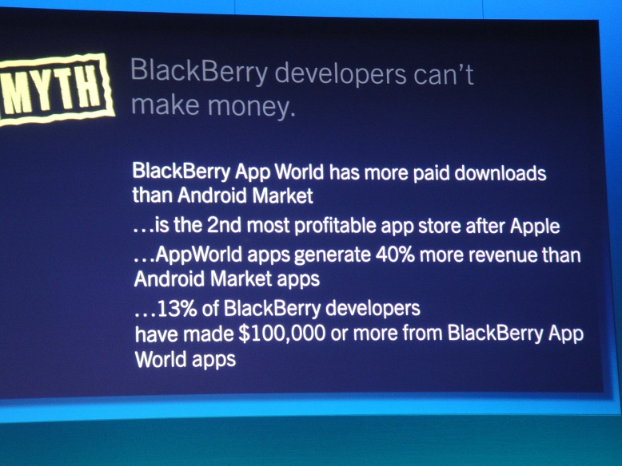

 خلال مؤتمر المطورين [Balckberry Devcon](http://www.blackberrydevcon.com/europe) المنعقد بأمستردام خلال الأسبوع الماضي أعلنت RIM  عن مجموعة من الأرقام المتعلقة بالشركة والتي تأتي لتزيل السحابة السوداء التي كانت تُلقي بظلالها على الشركة في الآونة الأخيرة.

 [جاء](http://www.pocketgamer.biz/r/PG.Biz/RIM+news/news.asp?c=37610) على لسان Heins Thorsten المدير التنفيذي الجديد:

<blockquote>

> 
>  نحن الرقم واحد في  كل من المملكة المتحدة، هولندا، المملكة العربية السعودية، الكويت، الإمارات العربية المتحدة، وجنوب إفريقيا.
> 
> 
</blockquote>

[وبلغة الارقام](http://www.gadget.co.za/pebble.asp?relid=4293) :

	  * رصدت RIM مالا يقل عن  75 مليون مستخدم لأجهزة blackberry
	  * تم بيع 180 مليون وحدة من الجهاز نفسه
	  * تم توزيع  2500 قطعة من جهاز blackberry playbook  على المطورين من أجل تحفيزهم
	  * 2 مليار تحميل على متجر التطبيقاتAppworld  منذ إنشائه، بمعدل 6 مليون تحميل يوميا (بمتوسط سنوي يعادل 30 تحميل لكل مستخدم).

 لكن الأهم حسب المدير التنفيذي أنRIM  و blackberry [تنفرد بخاصية مميزة](http://www.foxbusiness.com/technology/2012/02/07/blackberry-apps-more-profitable-to-developers-than-android-and-ios/) تتمثل في كون 13% من المطورين حققوا أرباحا تتجاوز 100,000$  على Appworld  مقابل  1% فقط من مطوري أجهزة الهواتف المحمولة عموما.

 فيما يرى Alec Saunders مسؤول العلاقات أنRIM  شهدت فترة تقهقر، لكنه يعقب:

<blockquote>

> 
> عملنا بجد، لنجعل من تطوير BlackBerry أكثر متعة ويسر
> 
> 
</blockquote>

حيث تم [توفير موقع ](https://bdsc.webapps.blackberry.com/devzone/) يسهل عمل المطورين.

 في سياق متصل، أكد Alec Saunders مسؤول العلاقات على التزام الشركة بالعمل على المصادر المفتوحة، قائلا:

<blockquote>

> 
> لديكم أطنان وأطنان من الأدوات مفتوحة المصدر للعمل عليها.
> 
> 
</blockquote>

 في حين نفى بعض المغالطات التي تقول أن مطوري blackberry  لا يجنون أرباحا، مبرزا أن appword يحقق أرباحا تفوق بنسبة 40% أرباح متجر Android Market.

 كما أعلن عن شراكة مع Qt ، مشيرا إلى أن RIM تود أن تصبح أفضل منصة لإطار العمل.Qt

 أما عن مستقبل blackberry 10  وأدوات تطويره، فسيكون واعدا وأكثر وضوحا خصوصا مع App World 3.1  الذي يوفر إمكانية تقديم الهدايا، فلترة عمليات البحث حسب التقييمات ... الخ.
