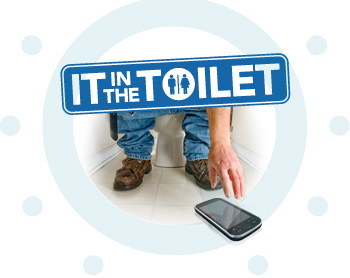

هناك من يتأمل... ليأتي بأفكار إبداعية.. وهناك من يقرأ الجرائد.. لكن هناك من يفضل أخذ هاتفه معه لدى الذهاب إلى دورة المياه.. إن كنت ممن يقومون بذلك فاعلم أنك لست الوحيد، فقد كشفت [دراسة نشرتها 11Mark](http://www.11mark.com/IT-in-the-Toilet) أن 75% من مستخدمي الهواتف الذكية الأمريكيين يستخدمونها في المراحيض أيضا.

في حين تُشير الدراسة إلى أن مستخدمي Droid هم الأكثر تمسكا بهواتفهم (87% من المشتركين في الدراسة من مستخدمي هاتف Droid سبق لهم أن استعملوا هواتفهم الذكية في ذلك المكان) يُفضل مستخدمو BlackBerry "اصطحاب هواتفهم" معهم إما للرد على المكالمات الواردة  (75% منهم) أو للاتصال بآخرين (48%)  وربما يعود ذلك إلى الطبيعية المهنية لهم التي تدفعهم إلى "الاستغلال الأمثل" لأوقاتهم.

أما مستخدمو iPhone فيميلون أكثر إلى استخدام الشبكات الاجتماعية (بدأت أفهم لماذا تظهر بعض التغريدات وتحديثات Facebook بتلك الغرابة :p) أو استخدام مختلف التطبيقات.

الدراسة لم تشمل سوى 1000 شخص، لكنها تُعطي صورة عن المكانة التي تشغلها الهواتف الذكية في حيواتنا. كما أنها قد تفتح الباب أمام نوع جديد من التطبيقات التي تستهدف هذه الشريحة من المستخدمين.

هل تصطحب معك هاتفك أينما حللت وارتحلت حتى في... أم أنت ممن "يحترمون" هواتفهم ويفضلون التأمل والتفكير...

