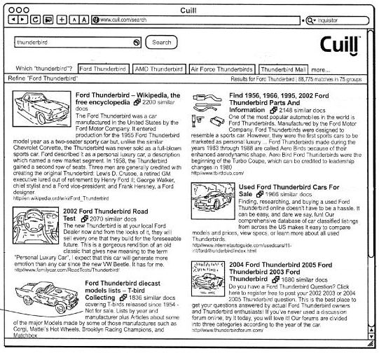

هل تذكرون محرك بحث Cuil؟ الذي قُدِّم على أساس أنه Google-Killer، مثلما توصف جميع محركات البحث التي تظهر ما بين الحين والآخر؟ شخصيا لا أذكر ذلك، لكن Google تتذكره جيدا، حيث اشترت مؤخرا سبعًا من براءات الاختراع الخاصة به رغم اندثار محرك البحث منذ سنتين ماضيتين.

Cuil مُحرك بحث أحدث ضجة كبيرة لدى انطلاقه لعدة أسباب منها أن مؤسِّسيه هم  كل من Anna Patterson وRussel Power الموظفان السابقان لدى Google اللذان انضم إليهما Louis Monier مؤسس محرك بحث AltaVista وTom Costello موظف سابق لدى IBM. كما أنه اشتهر أيضا بخوارزمياته التي قيل عنها حينها بأنها ستمكنه من منافسة Google بشراسة، إضافة إلى احترامه خصوصية مستخدميه، حيث أنه لا يحتفظ بأية بيانات عنهم، وهي النقطة التي تركز عليها محركات البحث الناشئة.

وعلى غير المتوقع، فإن براءات الاختراع التي اشترتها Google لا تتعلق بتلك الخوارزميات تحديدا، وإنما تتعلق بواجهة المحرك الرسومية، مثلما أشار إليه موقع Seo By The Sea الذي [كشف عن الأمر](http://www.seobythesea.com/2012/02/google-acquires-cuil-patent-applications/)، خصوصا ما تعلق منها بعرض نتائج البحث عبر ألسنة تبويب مختلفة تختلف باختلاف معنى الكلمات المبحوث عنها (كلمات تستعمل في عدة مجالات بمفاهيم مختلفة).

براءات الاختراع المعنية بالأمر والتي تم تقديمها سنة 2008، ما زالت قيد الدراسة (لم يتم منح براءات الاختراع للمتقدمين بها بعد)، إلا أنه من المُحتمل أن يتم استغلالها من طرف Google خاصة وأن Patterson (أحد مؤسسي محرك البحث) قد رجعت لتعمل من جديد لدى Google وتشغل حاليا منصب مديرة البحث.

للتذكير فإن سوق محركات البحث يشهد نشاطا كبيرا في الآونة الأخيرة، حيث ظهر مؤخرا محرك [Volunia](../2011/11/volunia/) الذي أسسه Massimo Marchiori صاحب خوارزمية HyperSearch التي تعتبر أساس خوارزمية PageRank الخاصة بمحرك Google. كما أن محرك بحث DuckDuckGo يعرف شعبية متزايدة حيث أنه تجاوز حاجز مليون عملية بحث يوميا [منذ أيام](https://twitter.com/#%21/duckduckgo/status/169517207435485185). هذا بالإضافة إلى محركات بحث محلية بدأت تكتسب وزنا كبيرا كمحرك بحث Baidu الصيني الذي يستحوذ على 78% من السوق الصينية والذي عرف زيادة معتبرة في [مداخيله](http://ir.baidu.com/phoenix.zhtml?c=188488&p=irol-newsArticle&ID=1662223&highlight=) خلال السنة المنصرمة ومحرك Yandex الروسي الذي يسطر بدوره على سوقه المحلية، والذي أعلن اليوم عن شراكة مع Twitter [لأرشفة تغريداته](http://company.yandex.com/press_center/press_releases/2012/2012-02-21.xml) قد تمكنه من استهداف أسواق أكبر من السوق الروسية.
