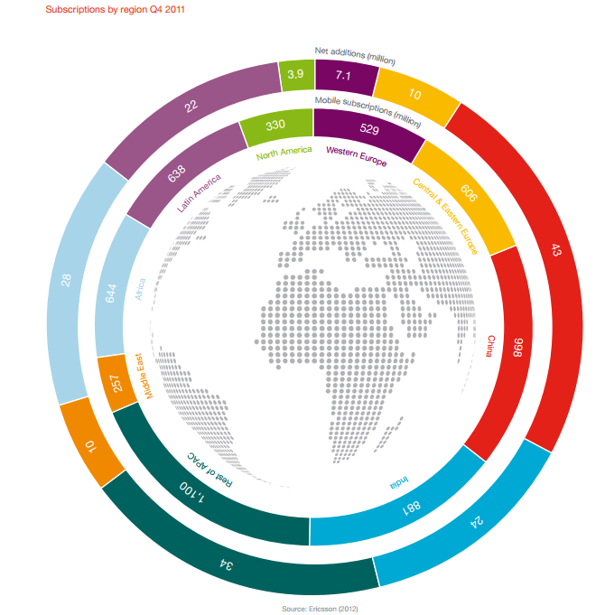

أظهر تقرير Trafic And Market Data Report الصادر عن [ Ericsson](http://www.ericsson.com/)  السويدية (صدر شهر فبراير الجاري كتحديث لتقرير [نوفمبر 2011](http://www.ericsson.com/news/1561267)) أنه يوجد حاليا 6 مليارات اشتراك بالهاتف المحمول عبر أنحاء العالم، ومع ذلك بقي استخدام الانترنت عبرها محدودًا نسبيا إذ لا يتجاوز نسبة 15 %.

 وفيما يلي بعض الأرقام التي [أوردها التقرير](http://www.ericsson.com/news/120222_mobile_subscribers_at_6_billion_244159020_c):

	  * بلغ انتشار الهواتف المحمولة  في العالم  نسبة  85 % في الربع الرابع من سنة 2011، ويبلغ عدد الاشتراكات بالهاتف المحمول الآن حوالي 6 مليارات.
	  * رغم أن هناك حوالي 6 مليار اشتراك بالهاتف النقال، فإن هناك فرقا كبيرا ما بين عدد الاشتراكات وعدد المشتركين، حيث أن الكثير لديهم عدة اشتراكات. الرقم يمثل حوالي 4.1 مليار مشترك فقط،ومع ذلك، ما يقارب من 60 %  من البشر لديهم على الأقل اشتراك واحد بالهاتف المحمول.
	  * تضاعفت حركة مرور البيانات بين الربع الثالث لسنة 2010 والربع الثالث لسنة 2011 بينما بلغ النمو الفصلي بين الربع الثاني والربع الثالث لسنة 2011 نسبة 18% .
	  * الهند والصين تشكلان مجتمعتين ما نسبته 35% من الاشتراكات الجديدة وهو ما يعادل 180 مليون مشترك جديد في الربع الأخير من سنة 2011.
	  * زاد عدد الاشتراكات بنسبة تقدر بحوالي 13% سنويا، وبنسبة 3% فصليا .
	  * اشتراكات GSM  تشكل حصة الأسد حيث تمثل 75%  من مجمل الاشتراكات في السوق، مقابل 15% لاشتراكات WCDMA/HSPA.

يوضح التقرير أيضا أن هناك إقبالا متزايدا على استخدام الهواتف الذكية، حيث تم بيع ما نسبته 30% من الهواتف الذكية العام الماضي 2011 مقارنة بنسبة 20% فقط سنة 2010، وبالرغم من هذه الزيادة المعتبرة إلا أن نسبة إجمالي مستخدميها تبقى ضئيلة نوعا ما، حيث [لا يتعدى مستخدمو الهواتف الذكية عبر العالم ما نسبته 10% من إجمالي المستخدمين](http://www.gomonews.com/only-around-10-per-cent-use-smartphones-says-ericsson/)، وهذا يعني أن هناك سوقا كبيرة تنتظر من سيُقبل عليها مستقبلا.

أما عن حركة نقل البيانات بواسطة مستخدمي الحواسيب المحمولة فإنها تختلف على نطاق واسع بين الأفراد والأسواق، لكن Ericsson تقدر المتوسط العالمي بحوالي 2 gb شهريا.

 كانت هذه إحصائيات تقريرEricsson  فماذاعن توقعات قراء المجلة؟ 60 % عبر العالم لديهم هواتف محمولة هل سنصل يوما للنسبة الكاملة؟ متى؟

 التقرير متوفر للتحميل من [هنا](http://www.google.com/url?sa=t&rct=j&q=&esrc=s&source=web&cd=2&ved=0CCwQFjAB&url=http%3A%2F%2Fwww.ericsson.com%2Fres%2Fdocs%2F2012%2Ftmd_report_feb_web.pdf&ei=9l1JT5PUNoSw0AXy5O2MDg&usg=AFQjCNFI22M7ymmozgeeB64Q9mK1pNwdLA)
