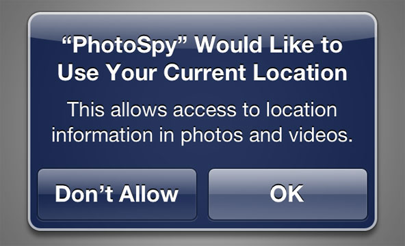

تتوالى "الفضائح" التي تُلاحق نظام iOS وتطبيقاته التي تُحاول تجميع بيانات مُستخدميها الشخصية [كتطبيقات Twitter](../2012/02/twitter-stores-iphone-contact/) وPath، [تُطلّ](http://bits.blogs.nytimes.com/2012/02/28/tk-ios-gives-developers-access-to-photos-videos-location/) علينا هذه المرة مدونة Bits التابعة New York Times لتكشف عن ثغرة تُمكّن التطبيقات من استرجاع الصور الشخصية وتحميلها.

الخلل يكمن في آلية السّماح بالوصول إلى بيانات المستخدم الخاصة بموقعه الجُغرافي، حيث أنه وبُمجرد أن يسمح المُستخدم بذلك فإنه يفتح المجال أمام التطبيقات للوصول إلى الصور وتحميلها، وهذا من دون أن تطلب منه أي إذن إضافي.

ولتأكيد الأمر طلبت New York Times من أحد المُطوّرين كتابة تطبيق خاص يقوم بذلك أطلقت عليه اسم PhotoSpy والذي تمكن من إتمام مهمّته بنجاح، دون أن يُثير أي انتباه أو شكوك.

سلسلة "الفضائح" التي عرفتها تطبيقات iOS مؤخرًا تدفع إلى التساؤل عن الدور الذي تلعبه Apple في هذه القضية، وما إذا كانت تقوم فعليا بالتحقق بشكل مُدقق من كل التطبيقات التي تُعرض على متجر AppStore مثلما تدّعيه، أم أن المُنافسة الشرسة التي تعرفها سوق الهواتف الذكية وتطبيقاتها (خاصة من جهة Android) دفعتها إلى أن تغض الطرف عن الأمر أو أنها لم تعد تولي اهتماما لحماية خصوصية مستخدمي منتجاتها مثلما كانت عليه من قبل.

ولتأكيد تراجع مُستوى الرقابة المفروض على متجر AppStore تستشهد جريدة New York Times بتطبيق Pokémon غير أصلي يكتفي بعرض بعض الصور، تم بيعه مقابل 99 سنتًا على متجر التطبيقات ونال شهرة كبيرة دفعته لأن يعتلي ترتيب أكثر التطبيقات مدفوعة الأجر تحميلا قبل أن تقوم Apple بسحبه.

هل لا زلت تثق في التطبيقات التي تُحملها من متجر AppStore؟
