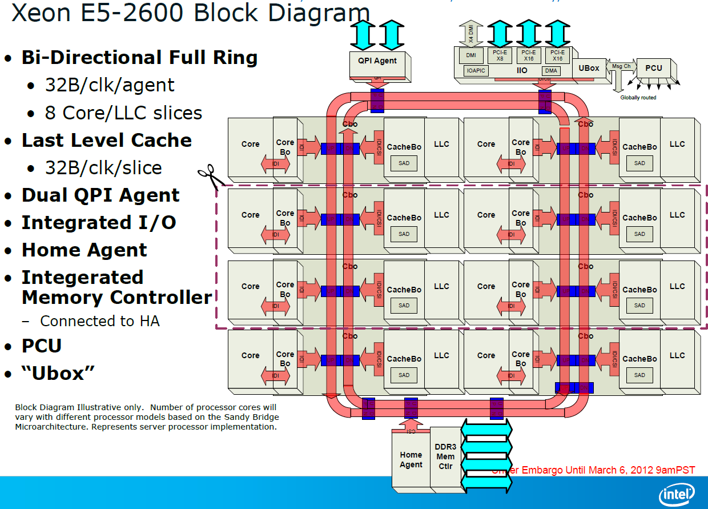

يوما بعد يوم يزيد الاستهلاك العالمي لمحتويات مواقع الإنترنت، مع دخول مستخدمين جدد لشبكة الإنترنت بشكل مستمر، ومع تزايد معدلات الاستخدام الحالية لمتصفحي مواقع الإنترنت، وهذه الزيادة الكبيرة تزيد من العبء الواقع على الخوادم التي تقدم الطعام لهذا الجمهور الجائع. هذا العبء يمكن معالجته بطرق كثيرة، لعل أهمها زيادة قدرات معالجات البيانات التي تدير الخوادم ، وهذا ما فعلته Intel بإعلانها عن أحدث مولود في عائلة Xeon ، المعالج E5-2600.

 

(انقر على الصورة لمُشاهدتها بحجمها الكامل)

 أهم ما قالته Intel في [مدح هذا الجديد](http://www.intel.com/content/www/us/en/processors/xeon/xeon-processor-5000-sequence.html) هو أنه معالج بيانات ذو أداء أسرع بمقدار 80% من سابقه Xeon 5600، وفي الوقت ذاته يستهلك طاقة أقل بمقدار النصف من Xeon 5600. عدا ذلك فهو معالج ذو ثمانية أنوية مع إعادة تصميم كل نواة من جديد، متوافق مع معمارية Sandy Bridge-E  و التشبيك عبر معمارية PCI Express 3.0 الجديدة، ويستطيع التعامل مع سعة ذاكرة قدرها 768 جيجا بايت، على شريحة إلكترونية ذات مقاس 32 نانومتر تسمح بتفعيل تيربو-2 من أجل سرعات إضافية كبيرة، ويدعم بطاقات الذاكرة DDR3 بسرعة 1600 في شريحتين فقط، وأما سعر البيع فمتوقع أن يبدأ من 200 دولارا لأدنى سرعة منه إلى غاية ألفي دولار لأسرع نسخة منه.

هذا، ومن المتوقع لشركات تصنيع الخوادم، مثل Dell و HP و IBM وغيرها، أن تعلن بداية من الأسبوع المقبل عن أحدث طرازاتها العاملة على ما قد يمكن النظر إليه على أنه أسرع معالج بيانات مخصص لعائلة الخوادم.

أما ما غاب عن هذا الإعلان فهو عدم ذكر أي شراكات متوقعة مع شركة Apple، والتي يشكو عشاقها من عدم تحديثها لمواصفات حاسوبها Mac Pro منذ فترة، وكانت Apple قد تعللت بأنها لم تجد معالجات قوية بعد تخرج من Intel، وهذا الجديد [يفند هذا العذر](http://www.electronista.com/articles/12/03/06/intel.xeon.e5.2600.given.official.arrival/)، على أن Apple مشهورة بحبها للسرية والغموض.

تشير توقعات شركة Cisco إلى زيادة سنوية دورية قدرها 33% في عدد مراكز البيانات العالمية التي تستضيف خوادم الإنترنت، وإلى بلوغ عدد مستخدمي الإنترنت 3 مليار مستخدم وبلوغ عدد الأجهزة المتصلة به قرابة 15 مليار جهاز، بحلول عام 2015.

 من المعلومات الطريفة أن شركة BMW الألمانية الشهيرة تستخدم خوادم تعمل على معالجات Xeon لتبقي سياراتها الفارهة على اتصال بالإنترنت.
