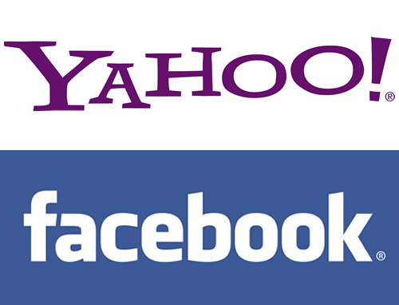

بعد أن [طالبت](https://www.it-scoop.com/2012/02/facebooks-yahoo-patent-problem-2/) بدفع أموال نظير استغلال براءات اختراعها، أقدمت شركة  Yahoo يوم أمس على رفع دعوى قضائية في محكمة كاليفورنيا ضد نظريتها Facebook متهمة إياها بالاعتداء على بعض براءات الاختراع الخاصة بـها، في خطوة تبدو منطقية خاصة وأن الأولى تُعاني من مشاكل عدة، والثانية تُحضر للدخول إلى البورصة.

الدعوى القضائية التي نشرت نسخة مما جاء فيها على موقع [All Things Digital](http://allthingsd.com/20120312/breaking-yahoo-sues-facebook-for-patent-infringement/) ، احتوت 10 اتهامات تخص الإعلانات، خصوصية المستخدم،وتقنيات التشبيك الاجتماعي

هذا، وقد جاء في الدعوى القضائية على لسان Yahoo أنه :

<blockquote>

> 
> من دون أفكارها واختراعاتها، ما كان لمواقع مثل Facebook أن تحصل على هذا العدد الضخم من الزوار الدائمين، ولا على دخل مرتفع جراء الإعلانات
> 
> </blockquote>

مستدلة بذلك باعتراف Mark Zuckerberg مؤسس ومدير Facebook أن فكرة موقعه هذا لم تكن جديدة وأنه اعتمد في إنشائه على أفكار موجودة مسبقا.

أربع من الاتهامات العشر التي جاءت في الدعوى القضائية تتعلق بالإعلانات، اثنتان تخصان خيارات المستخدم التي تتيح له الحفاظ على خصوصيته على الإنترنت، اثنتان تتعلقان بإنشاء المستخدمين لصفحات ويب، واحدة تتعلق التشبيك الاجتماعي (تقول Yahoo! أنها كانت سباقة إلى إتاحة إنشاء صفحات ومجموعات لمستخدميها)  . وواحدة أخيرة تتعلق بالدردشة التي تعتمد على بروتوكول البريد الالكتروني التي تستخدمتها Facebook.

الآن، وبعد هذه الخطوة من Yahoo تُطرح تساؤلات عديدة حول الصداقة التي كانت تجمع بينها وبين عملاق الشبكات الاجتماعية، وما إن كنا سنشهد حرب دعاوى قضائية بين عمالقة النت كالتي شهدناها بين Apple و Samsung من قبل؟ وإن كان الأمر كذلك ففي مصلحة أيهما سيصب ذلك في رأيك؟
