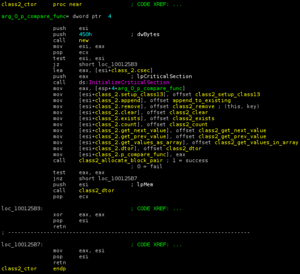
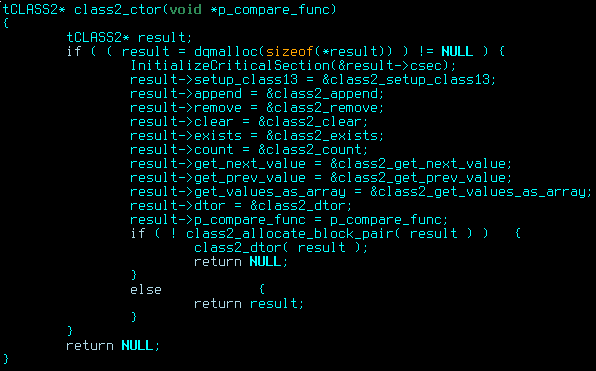

تم [كشف الستار](http://www.securelist.com/en/blog/677/The_mystery_of_Duqu_Framework_solved) أخيراً عن اللغة البرمجية الغامضة التي ذكرت Kaspersky من فترة قريبة، أن أجزاء كثيرة من إطار عمل Duqu قد كتبت بها، هذا وقد دفع غموض الرماز البرمجي شركة Kaspersky إلى [دعوة مجتمع المبرمجين](https://www.it-scoop.com/2012/03/kaspersky-duqu-trojan-uses-unknown-programming-language/) إلى المساهمة بما لديهم من معلومات قد تفيد بمعرفة اللغة التي كتبت بها تلك الأجزاء من Duqu.

[caption id="" align="aligncenter" width="620" caption="Disassembly of the original Duqu code: construction of the linked list class"][/caption]

بعد حصول Kaspersky على أكثر من 200 تعليق و 60 رسالة برريد إلكتروني حول اللغات وأطر العمل المحتمل أنه قد تم استخدامها في كتابة Duqu، تعود Kaspersky علينا [بتدوينة](http://www.securelist.com/en/blog/677/The_mystery_of_Duqu_Framework_solved) بقلم Igor Soumenkov تقول فيها "شكراً جزيلاً!" لكل من ساهم بأي معلومات قد تفيد في تحديد الرماز الغامض.

لنستعرض اللغات التي كانت الأكثر اقتراحاً من قبل المشاركين:

	  * أشكال مختلفة من LISP
	  * Forth
	  * Erlang
	  * Google Go
	  * Delphi
	  * OO C
	  * compilers قديمة لـ C++ ولغات أخرى.

وبفضل بعض التعليقات المفيدة جدًا والتي تدل على خبرة كاتبيها، أمكن القول الآن، وبدرجة كبيرة من الوثوق بأن Kaspersky وجدت إجابتها المنشودة.

<!-- more -->

فيما يلي نقتبس بعض المشاركات التي ساعدت بحل هذا اللغز:

<blockquote>

> 
> **igorsk
_Simple Object Orientation (for C)_**
_It seems someone over at reddit ([http://www.reddit.com/r/ReverseEngineering/](http://www.reddit.com/r/ReverseEngineering/)) hit the jackpot: the code snippets look _very_ similar to what this would produce:[http://daifukkat.su/wiki/index.php/SOO](http://daifukkat.su/wiki/index.php/SOO)_
_There are a few other OO frameworks for C, but they don't match as well: [http://ooc-coding.sourceforge.net/](http://ooc-coding.sourceforge.net/) [http://sooc.sourceforge.net/](http://sooc.sourceforge.net/)_
> 
> </blockquote>

<blockquote>

> 
> **Jonwil
_Re: Other C/C++ compiler?_**
_I have seen how GCC works internally and its ABI (for a number of different versions) and I can confirm that the Duqu code is definitely not generated by GCC. I don’t know how other C++ compilers work but the things I see in the ASM (like where the pointers to the functions go, the way the "this" pointer is passed etc) do not suggest C++ to me but something else entirely. (such as the aforementioned "object-oriented" frameworks for C that exist)_
> 
> </blockquote>

<blockquote>

> 
> **igorsk
_Re: Other C/C++ compiler?_**
_I’m 99% sure the machine code was generated by MSVC. It’s something you get a feel with experience, but I can point out two things that are quite characteristic of MSVC: 1) it uses esi as the first candidate for temporary storage; 2) “pop ecx” instead of “add esp, 4”._
> 
> </blockquote>

حصلت Kaspersky أيضاً على رسالتي بريد إلكتروني ملفتتين للانتباه، حيث اقترح كل من Pascal Bertrand المعروف بـ bps وكاتب آخر -فضل أن تبقى هويته غير معروفة- اقتراحا بأن الكود تمت كتابته بواسطة لغة كائنية التوجه، متفرعة عن لغة C، تدعى "OO C".

هذا وقد كانت التعليقات مهمة جدًا حيث ساعدت فريق Kaspersky على تتبع المترجم Compiler الذي تم استخدامه في المشروع: Microsoft Visual Studio compiler.

ويقول Igor بأنه قضى بعض الوقت يقوم بتجربة نسخ مختلفة من MSVC compilers وشفرات برمجية مختلفة وخيارات ربط مختلفة، في محاولة منه لتوليد الرماز المصدري الخاص بالتابع الباني المذكور في تدوينته السابقة التي دعى فيها للمساعدة بمعرفة اللغة.

[caption id="attachment_10340" align="aligncenter" width="596" caption="Manually decompiled C code that produces the same code"][/caption]

الكود السابق، عند ترجمته باستخدام MSVC 2008 والخيارات /O1 (minimize size) /Ob1 (expand only __inline) يقوم بتوليد opcodes مطابقة للتي تمت مشاهدتها في النسخة التنفيذية من Duqu.

ويضيف Igor بأنه في حال تم تغيير ترتيب العمليات وكُتل if/else فإن الكود الناتج سيختلف نوعًا ما عند استخدام MSVC 2005. لذلك يمكنهم القول وبدرجة عالية من الوثوق بأن اللغة المستخدمة كانت C وأنه تم استخدام MSVC 2008 مع الخيارات /O1 /Ob1.

ما يعنيه هذا الكلام بشكل مختصر، أنه يوجد احتمالان للسؤال الأساسي:

	  1. أن الكود تمت كتابته باستخدام إطار خاص من OO C، بالاعتماد على Macros أو موجهات خاصة للمعالج.
	  2. أن الكود بكامله قد كتب بـ OO C يدوياً، بدون أي إضافات إلى اللغة كالـ macros.

ونظرًا للتشابه الكبير في التعليمات في التوابع البناءة والتوابع الأعضاء، أمكن الافتراض بأن الاحتمال الأول هو الأقرب للواقع.

لكن لماذا  OO C بدلاً من C++ ؟

بمناقشة الفكرة مع بعض الأشخاص الذين يفضلون هذه التقنيات، أمكن استخلاص سببين لهذا الأمر:

	  1. لا يثقون بـ C++ compilers، وهؤلاء هم غالبًا أناس بدؤوا البرمجة منذ زمن بعيد، عندما كانت المجمّعات assemblers هي الخيار الأمثل. C كانت لغة ثورية في ذلك الوقت تجاوزت لغة التجميع وسرعان ما أصبحت اللغة القياسية في البرمجة. عندما تم نشر C++ فإن الكثيرين من المبرمجين القدامى فضّلوا أن يلتزموا باستخدام C بدلًا منها لعدم ثقتهم بطرق حجز الذاكرة وخصائص أخرى غامضة في اللغة تسمح بتنفيذ كود برمجي بشكل غير مباشر (على سبيل المثال، التوابع البناءة).
	  2. الـ portability العالية. حيث يمكن ترجمة كود C باستخدام الكثير من الـ compilers. فمثلًا، منذ زمن طويل (10 - 12 سنة مضت) كان بالإمكان ترجمة كود C++ على MSVC في حين لم يكن بالإمكان ترجمة ذات الكود على Watcom C++ مثلاً. لذلك إن أردت الحصول على منقولية عالية بين المنصات، فعليك البرمجة بلغة C.

هذان السببان يقترحان بشكل غير مباشر أن الفريق المسؤول عن برمجة Duqu مؤلف من مبرمجين مخضرمين، يتبعون لنمط "المدرسة القديمة" في البرمجة.
