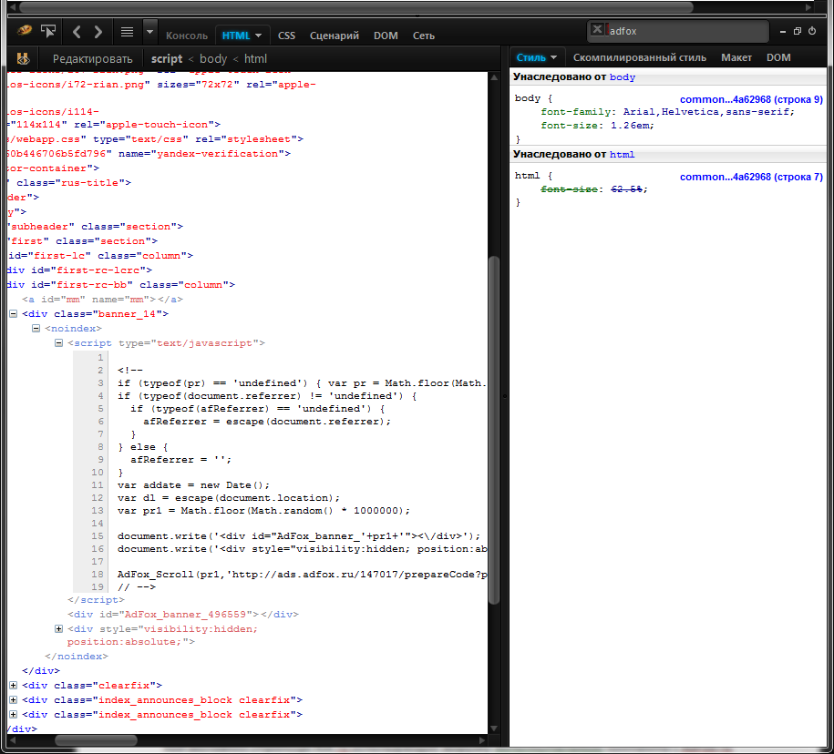
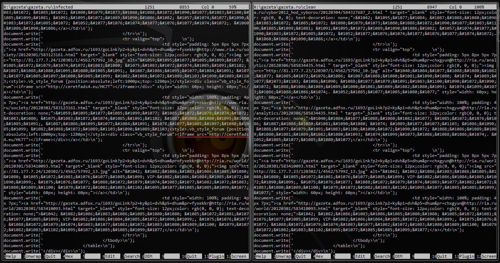
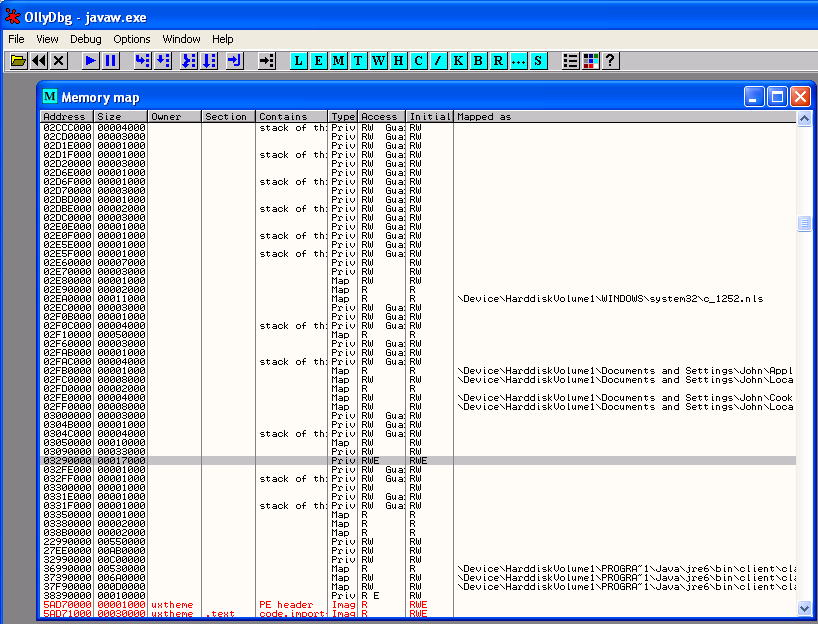

نشرت Kaspersky [خبرًا](http://www.securelist.com/en/blog/687/A_unique_news_site_visitors)، على لسان أحد خبرائها الأمنيين Sergey Golovanov، يشير فيها إلى ظهور نوع جديد من هجمات الـ [bot](http://en.wikipedia.org/wiki/Internet_bot)s لا يتم فيه إنشاء أي ملف خبيث على القرص الصلب، حيث تبقى الإصابة نشطة في الذاكرة RAM إلى حين إعادة تشغيل الجهاز فقط.

[caption id="attachment_10351" align="aligncenter" width="641" caption="The code on the main page of RIA.ru that is used to download additional content from AdFox.ru"][/caption]

 مصدر الإصابة الذي لاحظته Kaspersky كان الإعلانات المحقونة من شركة إعلانية روسية مشهورة AdFox.ru والتي تقوم مواقع روسية كثيرة بالتعامل معها لإظهار إعلانات موجهة على صفحاتها.

بعد تحليل الصفحات البرمجية للمواقع المصابة لعدة أيام بحثاً عن أي تغيير قد يطرأ على الكود البرمجي، توصل خبراء Kaspersky إلى أن الكود الوحيد الذي تغير هو التابع لشركة AdFox.ru

وفيه ظهر بأن أحد ملفات JavaScript التي يتم تحميلها من موقع AdFox.ru تحوي على iframe تقوم بتحويل المستخدم إلى مواقع ذات محتوى خبيث تملك نطاقات أوروبية .EU والتي بدورها تحتوي على استغلال لثغرة Java معروفة.

[caption id="attachment_10352" align="aligncenter" width="610" caption="The contents of an infected and a clean JS script"][/caption]

بعد تحليل ملف JAR الذي يتم تحميله من خلال أحد تلك المواقع، تبين أنه يقوم باستغلال الثغرة ذات المعرف CVE-2011-3544 والتي يقوم مجرمو الانترنت باستغلالها منذ نوفمبر الماضي في عام 2011، الثغرة التي تستهدف كلا من نظامي Mac OS و Windows. وتجدر الإشارة إلى أن هذه الثغرة تعد من أكثر الثغرات شهرة واستخداماً في الحزم الفيروسية الخبيثة التي يتم شراؤها واستخدامها عبر الانترنت.

لكن ما الذي يميز هذه البرمجية الخبيثة عن غيرها؟

كقاعدة في استغلال هذه الثغرة يتمثل في حفظ ملف خبيث على القرص الصلب لأحد الأنظمة المصابة، والذي يكون عادة dropper/downloader يوجهه صاحبه إلى تحميل برمجيات خبيثة أخرى لاحقاً بغفلة عن أعين مستخدمي النظام المصاب.

لكن في خبرنا هذا، فإن البرمجية الخبيثة لا تقوم بوضع أي ملف على القرص الصلب، على العكس، فإنها تقوم بحقن الحمل الضار payload ضمن ملف DLL في ذاكرة برنامج javaw.exe مباشرة من الويب. ويكون العنوان الذي يحوي على المكتبة الضارة مشفراً ضمن الـ iframe الموزعة من إعلانات AdFox.ru.

<applet code="Applet.class" archive="/0GLMFss"><param name="cookie" value="j::eHff8dCis:ys4iNfnUWP7yy"></applet>

[caption id="attachment_10353" align="aligncenter" width="573" caption="الجزء المشار إليه في الصورة بلون مظلل هو المقطع الضار الذي تم حقنه في فضاء عناوين javaw.exe"][/caption]

بعد أن يتم الحقن بنجاح، تقوم المكتبة الضارة التي تم حقنها في الذاكرة بإرسال طلبات إلى عناوين عبر الانترنت، تشبه هذه الطلبات إلى حد بعيد استعلامات البحث في محرك Google، كالتالي على سبيل المثال:

"search?hl=us&source=hp&q=%s&aq=f&aqi=&aql=&oq="

تتضمن هذه الطلبات معلومات عن المواقع التي قام المستخدم بزيارتها والتي يتم الحصول عليها من المتصفح، بالإضافة إلى العديد من المعلومات الأخرى حول النظام المصاب.

ونظراً للطريقة المستخدمة في حقن الكود الخبيث في ذاكرة برنامج، فإنه يبقى نشطاً إلى حين إعادة تشغيل النظام المصاب فقط، لكن في هذه الحالة، فهذا الأمر لن يؤثر على أصحاب هذه الـ bot.

ومن الأسباب خلف هذا الاعتقاد، أنه بعد أن يتم إرسال عدد من الطلبات إلى قاعدة التحكم C&C واستلام إجابات منها، تقوم البرمجية الضارة باستخدام وسائل عديدة لتعطيل ميزة UAC (في Windows Vista+)، يصبح بإمكان البرمجية بعدها تثبيت نسخة من تروجان Lurk على الجهاز المصاب. ومن الجدير بالذكر بأنه قرار تثبيت نسخة من التروجان يتم استلامه من قاعدة الإدارة والتحكم.

السبب الثاني، أن احتمال عودة مستخدم هذا النظام إلى أحد المواقع المصابة بإعلانات AdFox.ru والتي حصل على إصابته الأولى منها، عالٍ.

ولكون البرمجية الضارة لا تقوم بكتابة أي ملف ضار إلى القرص الصلب عند الإصابة، يصبح من الصعب جداً على مكافحات الفيروسات التقاط الإصابة.

