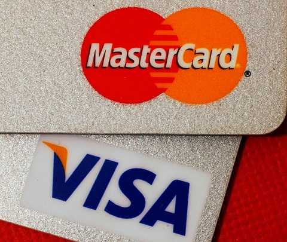

تقوم كل من Visa و MasterCard بتحذير البنوك التي تتعامل معها وتنبيههم إلى وقوع [اختراق ضخم جداً](http://arstechnica.com/business/news/2012/03/massive-credit-card-breach-reportedly-hits-visa-mastercard.ars) لأحد معالجات عمليات الدفع والذي يقع في الولايات المتحدة الأمريكية. ووفقاً [للتقارير](https://krebsonsecurity.com/2012/03/mastercard-visa-warn-of-processor-breach/) التي نشرها موقع KrebsonSecurity.com والتي أتبعها لمصادر مجهولة، فإن ما يقارب من "10 ملايين بطاقة ائتمان قد سرقت"، بينما [أعلنت](http://online.wsj.com/article/SB10001424052702303816504577313411294908868.html) Wall Street Journal في أخبار منفصلة ولمصادر مجهولة أخرى، عن هوية المعالج المخترق بأنه شركة Global Payments Inc.

كل التقارير تشير إلى أن Visa تقوم بإرسال تنبيهات إلى البنوك لإعلامها بوقوع اختراق للشبكة والذي استمر في الفترة بين 21 يناير حتى 25 فبراير المنصرم.

وفقاً لـ KrebsonSecurity فإن كلا من بيانات الشريطين الأول والثاني في المساحة الممغنطة من البطاقة قد سرقت، مما يعني بأن المخترقين لديهم كل المعلومات التي يحتاجونها الآن لتزوير بطاقات ائتمان ببياناتها الكاملة!

نتيجة لفداحة هذا الاختراق، فإن كلا من الاستخبارات الخاصة الأمريكية وإحدى شركات التحقيق الجنائي الرقمي بدأتا تحقيقاً واسعاً حول الموضوع، والذي ما يزال في بدايته الآن.

بعد انتشار هذه الأخبار، قامت Global Payments بإصدار بيان أكدت فيه أنها

<blockquote>

> 
> قامت باكتشاف والتبليغ بشكل طوعي عن حصول اختراق لأحد أنظمة المعالجة الخاصة بها
> 
> 
</blockquote>

وأضافت:

<blockquote>

> 
> في مطلع مارس 2012، قامت الشركة بتحديد احتمالية حصول اختراق لبياناتها. وفوراً، أبلغنا عدة خبراء في التحقيق الجنائي الرقمي واتصلنا بالجهات الأمنية الرسمية. أيضاً، أبلغنا الشركات المتضررة للسماح لهم بتخفيض حدة الضرر الناتج عن هذا الاختراق. ما زال التحقيق جارياً في الموضوع.
> 
> 
</blockquote>

من جهتها صرحت Visa بأن الاختراق الذي حصل وقع في خوادم أحد الشركاء وليس هناك أي اختراق لأي خادوم أو بيانات تابعة لـ Visa مباشرة.

أشارت CNN بأنه فور انتشار أخبار هذا الاختراق، انخفضت حصة أسهم Global Payments [بأكثر من 9%](http://money.cnn.com/2012/03/30/technology/credit-card-data-breach/index.htm?hpt=hp_t3).
