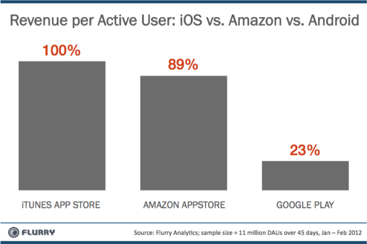

غريب هو حال سوق الهواتف الذكية، ويزداد غرابة لما يكون لشركة Google أو لنظامها **Android** علاقة بالأمر، حيث أشارت دراسة نشرتها **Flurry** بأن سوق تطبيقات Google (الذي أُعيدت تسميته ليصبح **Google Play**) هو الأقل دخلا مُقارنة بمتجر AppStore أو حتى بمتجر تطبيقات Amazon الذي يعتمد هو أيضا على نظام Android.

قامت Flurry بدراسة بعض التطبيقات التي تتوفر على المتاجر الثلاثة في آن واحد وذلك لمدة 45 يوما، وركزت [الدراسة](http://blog.flurry.com/bid/83604/For-Generating-App-Revenue-Amazon-Shows-Google-How-to-Play) على مداخيل هذه التطبيقات من عمليات البيع التي تتم من خلال هذه التطبيقات أو ما يُعرف بعمليات الشراء **in-app**** **وتبين بأنه مُقابل كل دولار يتم جنيه على نظام iOS** **فإنه لا يتم جني سوى 89 سنتا على متجر Amazon** **مُقابل 23 سنتا على متجر Google Play.

حسب Flurry** **فإن الأمر راجع إلى خبرة كل شركة في المجال الذي تنشط فيه، حيث تعتبر تجربة Apple مع متجرها Itunes رائدة في مجال البيع على الهواتف، كما أن Amazon لها باع طويل في مجال البيع على الإنترنت مما سمح لها باستقطاب زبائن كثر على متاجر تطبيقات أجهزتها. إلا أن هذا المجال يبقى بعيدا نوعا ما عن اختصاص Google المُتمثل أساسًا في مُحركات البحث.

وترجّح الدراسة أن نشهد إقبال المبرمجين على كتابة تطبيقات لأجهزة Kindle نظرا للعوائد المالية المُعتبرة منه مُقارنة بمتجر Google Play إضافة إلى احتمال أن تحاول Samsung استنساخ تجرب Amazon بإنشاء نسخة Android خاصة بها.

على صعيد آخر أشارت جريدة [The Guardian](http://www.guardian.co.uk/technology/2012/mar/29/google-earns-more-iphone-android) البريطانية بأن Google جنت من خلال نظام iOS أضعاف ما جنته بفضل نظامها الخاص Android، حيث أنه لم تبلغ مداخيل Google من نظامها خلال الفترة الممتدة ما بين 2008 ونهاية 2011 سوى 550 مليون دولار في حين استطاعت أن تحقق أربعة أضعاف ذلك خلال نفس الفترة بفضل نظام iOS وذلك بفضل الإعلانات على محرك بحثها حيث يُعتبر محرك البحث القياسي على مُتصفح Safari على نظام iOS إضافة إلى الإعلانات على خرائط Google Maps.

الأمر مُشابه لما يحدث مع Microsoft والتي تجني هي أيضا بفضل نظام Android أكثر مما تجنيه من نظام Windows Phone  وذلك لمطابتها بحقوق براءات اختراعها التي تزعم بأنها مُستغلة من طرق نظام Google.

الأرقام التي نشرتها The Guardian ليست رسمية لكن من المرجح أن تكون دقيقة لكونها مُستخرجة من إحدى وثائق المُحاكمة القائمة ما بين Oracle و Google حول نظام Android.
