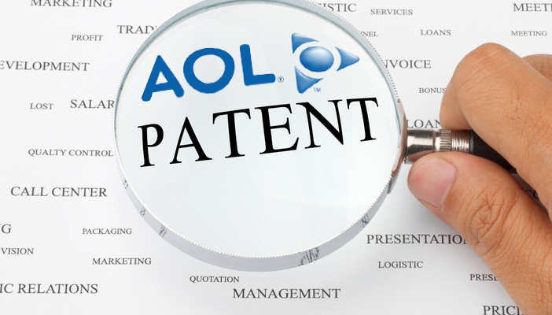

أعلنت **AOL** اليوم عن توصلها لاتفاق مع **Microsoft** لبيع 800 من أصل 1100 (أو يزيد) **براءة اختراع** تملكها ، إضافة إلى حصولها (حصول Microsoft) على حق استغلال الثلاثمائة براءة اختراع المُتبقية لديها مُقابل 1.056 مليار دولار.

تشمل هذه الصفقة أغلب ما توصلت إليه AOL من "اختراعات"، وتغطي عدة مجالات، كالإعلانات والبحث على الإنترنت، الشبكات الاجتماعية، تحديد المواقع وغيرها.

بالرغم من أن [البيان الصُحفي](http://corp.aol.com/2012/04/09/aol-and-microsoft-announce-1-056-billion-patent-deal/) الذي يُعلن عن هذه العملية يحاول أن يعطي صورة إيجابية حولها، حيث أنه ركز على أن الصفقة كانت نتيجة مزاد قوي، إضافة إلى إبقائها على 300 براءة اختراع في حوزتها، إلا أنها لم تُشر إلى الضغوطات التي تعرضت إليها من  طرف الصندوق الاستثماري [Starboard Value](http://www.businessweek.com/news/2011-12-22/aol-should-take-immediate-action-investor-starboard-says.html)  والذي سبق وأن أبدى رغبته في أن تقوم الشركة ببيع براءات اختراعها.

تُشير AOL بأنها ستقوم بتحويل قسم مهم من عوائد هذه العملية إلى مستثمريها بدل إعادة استثمارها في الشركة.

وفقا لموقع [Cnet](http://news.cnet.com/8301-10805_3-57411434-75/why-microsoft-spent-$1-billion-on-aols-patents/) فإن Google لم تكن مهتمة بالمزايدة على براءات اختراع AOL، وهو ما يدفع إلى التساؤل عن السبب الذي جعل Microsoft تدفع كل هذا القدر للحصول عليها. ويضيف الموقع بأن Microsoft كانت الأحوج لها والأقرب إلى نشاطاتها، حيث أنها تستشهد بها (كتقنيات/براءات اختراع ذات صلة) في طلبات براءات اختراعها أكثر من أي شركة أخرى، بل حتى أكثر من AOL نفسها، كما أنها كانت ترغب في منع أي منافس من الوصول إليها.

تجدر الإشارة إلى أن العديد من الشركات أصبح تلجأ مؤخرا إلى بيع/شراء أعداد هائلة من براءات الاختراع دفعة واحدة، وأهمها تلك التي [اشترت فيها Google 6000](https://www.it-scoop.com/2011/04/google-6000-patents-900-millions/) (نعم 6000 آلاف) براءة اختراع من عند Nortel مُقابل 900 مليون دولار، وأحدثها شراء [فيس بوك 750 براءة اختراع من عند IBM](https://www.it-scoop.com/2012/03/facebook-buys-750-ibm-patents/).

السؤال الذي يطرح نفسه الآن، إذا لم تستطع AOL أن تسترجع عافيتها وهي تملك براءات اختراعها كاملة، فهل ستقدر على ذلك، وقد "تخلصت" من أغلبها؟
