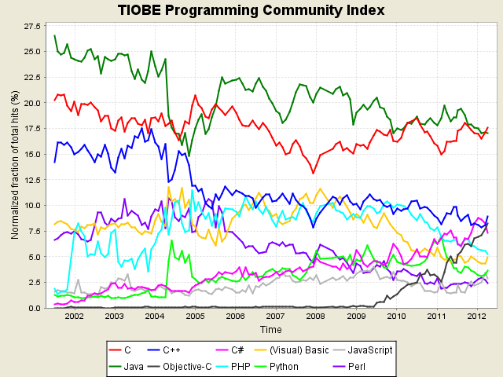

كشفت **Tiobe** عن ترتيبها لأكثر لغات البرمجة شعبية لشهر أبريل الجاري، والذي تميز بتخلي لغة **Java** عن مرتبتها الأولى لصالح لغة **C**، مثلما كان متوقعا منذ عدة أشهر.

رغم ذلك فإن [Tiobe](http://www.tiobe.com/index.php/content/paperinfo/tpci/index.html) تتوقع أن لا تبقى C في الصدارة لأكثر من أشهر معدودات، كما أنها تستبعد أن تواصل لغة Java تراجعها، ويعود الأمر إلى الاهتمام الذي تحظى به اللغة كونها اللغة البرمجية التي تُكتب بها تطبيقات أنظمة Android.

كما كشف الترتيب عن عدة "تحركات" صعودا وهبوطا في الترتيب العام، حيث تواصل PHP تراجعها، حالها حال  Python و Perl. أما C++ فلقد استرجعت مرتبتها الثالثة.

تأثير الهواتف الذكية بشكل عام وهواتف iPhone بشكل خاص لا يزال يلعب دورا مهما في شعبية لغات البرمجة، ويظهر الأمر جليا على لغة Objective-C التي يُبين الترتيب أنها تزداد شعبية، حيث احتلت المرتبة الرابعة، مُتجاوز بذلك لغات "عتيدة" كلغات إطار عمل Dotnet.

تجدر الإشارة إلى أن ترتيب Tiobe لا يقيس مدى استخدام/ انتشار لغات البرمجة، بل يهتم بمدى شعبيتها، ويعتمد على محركات البحث (Google وأخواتها) إضافة إلى Wikipedia، Youtube وAmazon.

إليكم قائمة لغات البرمجة العشرين الأكثر شعبية خلال شهر أبريل 2012:

<!-- more -->

<table cellpadding="0" border="1" >
<tbody >
<tr >

<td nowrap="nowrap" >

**الترتيب****
أبريل 2012**

</td>

<td nowrap="nowrap" >

**الترتيب****
أبريل 2011**

</td>

<td nowrap="nowrap" >

**الحالة******

</td>

<td nowrap="nowrap" >

**لغة البرمجة******

</td>

<td nowrap="nowrap" >

**الشعبية**

**أبريل 2012******

</td>

<td nowrap="nowrap" >

**الشعبية **

**أبريل 2011******

</td>
</tr>
<tr >

<td >

1

</td>

<td >

2

</td>

<td >

↑

</td>

<td >[C](http://www.tiobe.com/content/paperinfo/tpci/C.html)
</td>

<td >

17.555%

</td>

<td >

+1.39%

</td>
</tr>
<tr >

<td >

2

</td>

<td >

1

</td>

<td >

↓

</td>

<td >[Java](http://www.tiobe.com/content/paperinfo/tpci/Java.html)
</td>

<td >

17.026%

</td>

<td >

-2.02%

</td>
</tr>
<tr >

<td >

3

</td>

<td >

3

</td>

<td >

=

</td>

<td >[C++](http://www.tiobe.com/content/paperinfo/tpci/C__.html)
</td>

<td >

8.896%

</td>

<td >

-0.33%

</td>
</tr>
<tr >

<td >

4

</td>

<td >

8

</td>

<td >

↑ ↑ ↑ ↑

</td>

<td >[Objective-C](http://www.tiobe.com/content/paperinfo/tpci/Objective-C.html)
</td>

<td >

8.236%

</td>

<td >

+3.85%

</td>
</tr>
<tr >

<td >

5

</td>

<td >

4

</td>

<td >

↓

</td>

<td >[C#](http://www.tiobe.com/content/paperinfo/tpci/C_.html)
</td>

<td >

7.348%

</td>

<td >

+0.16%

</td>
</tr>
<tr >

<td >

6

</td>

<td >

5

</td>

<td >

↓

</td>

<td >[PHP](http://www.tiobe.com/content/paperinfo/tpci/PHP.html)
</td>

<td >

5.288%

</td>

<td >

-1.30%

</td>
</tr>
<tr >

<td >

7

</td>

<td >

7

</td>

<td >

=

</td>

<td >[(Visual) Basic](http://www.tiobe.com/content/paperinfo/tpci/(Visual)_Basic.html)
</td>

<td >

4.962%

</td>

<td >

+0.28%

</td>
</tr>
<tr >

<td >

8

</td>

<td >

6

</td>

<td >

↓ ↓

</td>

<td >[Python](http://www.tiobe.com/content/paperinfo/tpci/Python.html)
</td>

<td >

3.665%

</td>

<td >

-1.27%

</td>
</tr>
<tr >

<td >

9

</td>

<td >

10

</td>

<td >

↑

</td>

<td >[JavaScript](http://www.tiobe.com/content/paperinfo/tpci/JavaScript.html)
</td>

<td >

2.879%

</td>

<td >

+1.37%

</td>
</tr>
<tr >

<td >

10

</td>

<td >

9

</td>

<td >

↓

</td>

<td >[Perl](http://www.tiobe.com/content/paperinfo/tpci/Perl.html)
</td>

<td >

2.387%

</td>

<td >

+0.40%

</td>
</tr>
<tr >

<td >

11

</td>

<td >

11

</td>

<td >

=

</td>

<td >[Ruby](http://www.tiobe.com/content/paperinfo/tpci/Ruby.html)
</td>

<td >

1.510%

</td>

<td >

+0.03%

</td>
</tr>
<tr >

<td >

12

</td>

<td >

24

</td>

<td >

↑ ↑ ↑ ↑ ↑ ↑ ↑ ↑ ↑ ↑

</td>

<td >[PL/SQL](http://www.tiobe.com/content/paperinfo/tpci/PL_SQL.html)
</td>

<td >

1.373%

</td>

<td >

+0.92%

</td>
</tr>
<tr >

<td >

13

</td>

<td >

13

</td>

<td >

=

</td>

<td >[Delphi/Object Pascal](http://www.tiobe.com/content/paperinfo/tpci/Delphi_Object_Pascal.html)
</td>

<td >

1.370%

</td>

<td >

+0.34%

</td>
</tr>
<tr >

<td >

14

</td>

<td >

35

</td>

<td >

↑ ↑ ↑ ↑ ↑ ↑ ↑ ↑ ↑ ↑

</td>

<td >[Visual Basic .NET](http://www.tiobe.com/content/paperinfo/tpci/Visual_Basic__NET.html)
</td>

<td >

0.978%

</td>

<td >

+0.64%

</td>
</tr>
<tr >

<td >

15

</td>

<td >

15

</td>

<td >

=

</td>

<td >[Lisp](http://www.tiobe.com/content/paperinfo/tpci/Lisp.html)
</td>

<td >

0.951%

</td>

<td >

+0.02%

</td>
</tr>
<tr >

<td >

16

</td>

<td >

17

</td>

<td >

↑

</td>

<td >[Pascal](http://www.tiobe.com/content/paperinfo/tpci/Pascal.html)
</td>

<td >

0.812%

</td>

<td >

+0.10%

</td>
</tr>
<tr >

<td >

17

</td>

<td >

16

</td>

<td >

↓

</td>

<td >[Ada](http://www.tiobe.com/content/paperinfo/tpci/Ada.html)
</td>

<td >

0.783%

</td>

<td >

+0.01%

</td>
</tr>
<tr >

<td >

18

</td>

<td >

18

</td>

<td >

=

</td>

<td >[Transact-SQL](http://www.tiobe.com/content/paperinfo/tpci/Transact-SQL.html)
</td>

<td >

0.760%

</td>

<td >

+0.18%

</td>
</tr>
<tr >

<td >

19

</td>

<td >

22

</td>

<td >

↑ ↑ ↑

</td>

<td >[Logo](http://www.tiobe.com/content/paperinfo/tpci/Logo.html)
</td>

<td >

0.652%

</td>

<td >

+0.12%

</td>
</tr>
<tr >

<td >

20

</td>

<td >

52

</td>

<td >

↑ ↑ ↑ ↑ ↑ ↑ ↑ ↑ ↑ ↑

</td>

<td >[NXT-G](http://www.tiobe.com/content/paperinfo/tpci/NXT-G.html)
</td>

<td >

0.578%

</td>

<td >

+0.35%

</td>
</tr>
</tbody>
</table>

