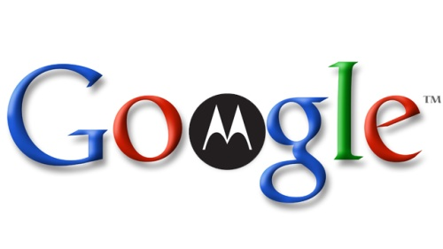

أشارت جريدة Wall Street Journal أن **Google** بصدد التحضير لبيع شركة **Motorola** التي اشترتها [مُقابل 12.5 مليار دولار](https://www.it-scoop.com/2011/08/google-motorola-mobility/) لصالح **Huawei** لكن مع احتفاظها ببراءات الاختراع الخاص بها والمُقدرة بنحو 17 ألفًا.

سبق وأن أشارت Google على لسان Allen Lo أحد مستشاريها القانونيين في [حوار خص به موقع Cnet](http://news.cnet.com/8301-1023_3-57409828-93/yes-google-needed-motorola-for-the-patents/) بأن الهدف الأول من وراء شراء Motorola هو براءات الاختراع الخاصة بها، رغم ذلك يُبين Lo  بإن Google لا تنوي مُقاضاة أي شركة تستغل براءات اختراعها من دون إذنها ما لم تُسابق هي إلى ذلك، وإنما هدف Google هو حماية نفسها وتكوين حماية رادعة ضد الشركات المنافسة لها.

وإن صدق [الخبر الذي أشارت إليه Wall Street Journal](http://online.wsj.com/article_email/SB10001424052702304587704577335990254389120-lMyQjAxMTAyMDEwMDExNDAyWj.html) فإن Google "ستتخلص" مما تبقى من Motorola بعد أن أفرغتها من أزكى مُحتوياتها، وستبيعها إلى شركة لا تهدف إلى الحصول على براءات اختراع، وإنما تبحث عن منافذ للأسواق التي تملك Motorola حصصا مهمة فيها ويتعلق الأمر بالمُصنّع الصيني Huawei بالرغم من كل الحساسية التي تحملها فكرة شراء شركة صينية لشركة أمريكية.

من جهة أخرى، قد لا يكون بيع Google لشركة Motorola –إن تم الأمر- لمجرد التخلص مما تبقى منها، بل من أجل طمأنة شركائها حول نظام Android، فمن جهة ستضمن لهم حماية مُعتبرة تقيهم شر هجمات براءات الاختراع من طرف المُنافسين، ومن جهة أخرى ستضمن لهم من جديد حيادها، وعدم تفضيلها لأي طرف على آخر، حيث أن الكثير من الأصوات تعالت بعد خبر شرائها لشركة Motorola تُشكك في صدق نواياها وفي إمكانية تفضيلها "شركتها الفرعية" على باقي المُصنعين.

تجدر الإشارة إلى أن صفقة شراء Google لشركة Motorola لم تتم بشكل نهائي بعد، حيث لا تزال تنتظر مُباركة السلطات الصينية، وذلك بعد أن حصلت على موافقة السلطات المعنية بالأمر في الاتحاد الأوروبي وفي الولايات المتحدة.

في رأيك، هل ستبيع Google ما تبقى من Motorola تخلصا من بقايا شركة لا ترغب فيها؟ أم رغبة منا في استعادة ثقة شركائها فيها من جديد؟
