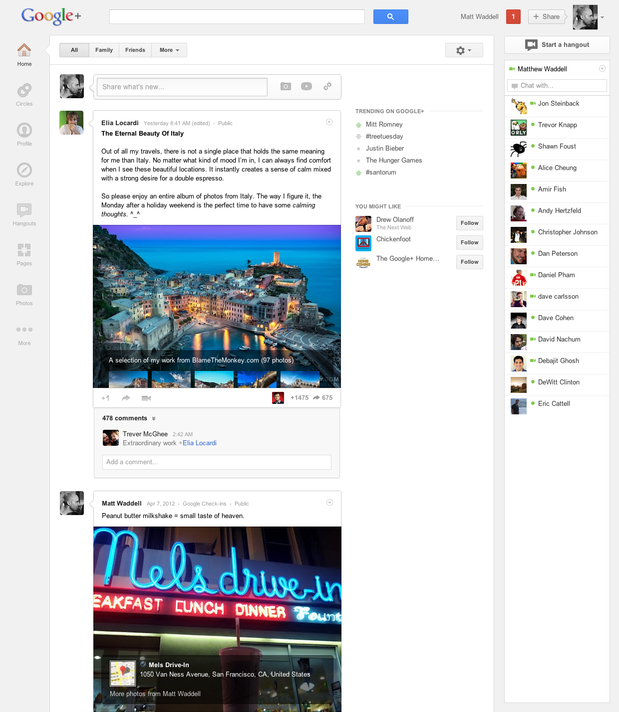
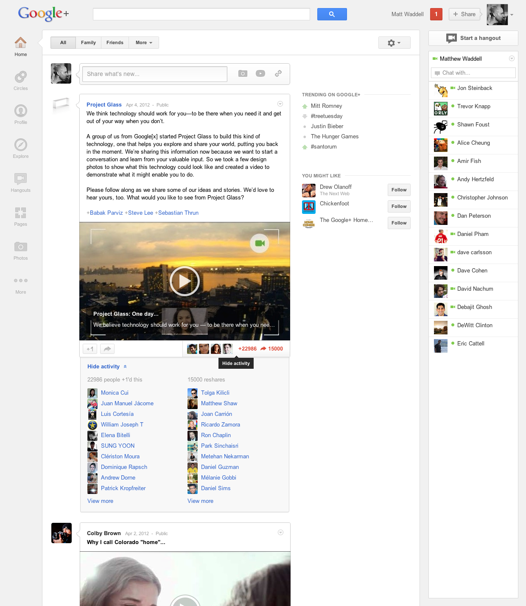
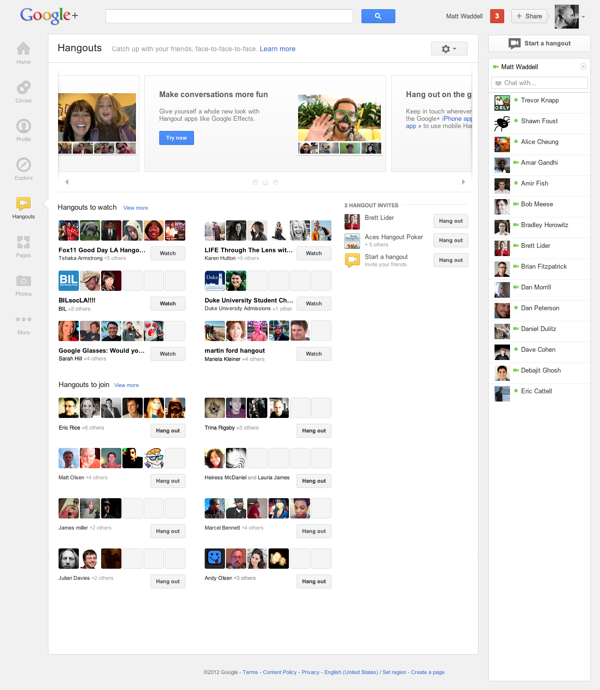
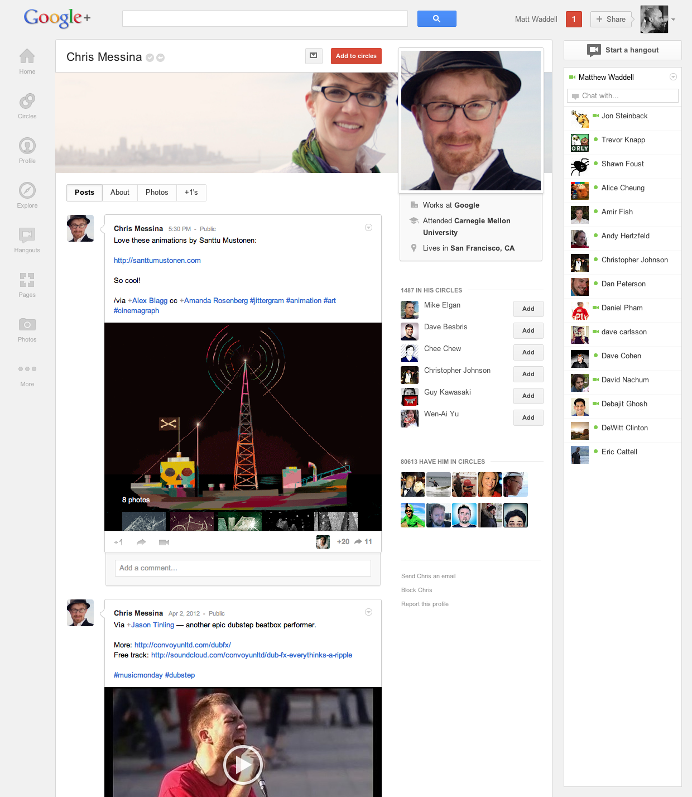

منذ بضع ساعات أعلنت Google على مدوّنتها الرّسميّة عن تصميم جديد لنسخة الويب من طبقتها الاجتماعيّة النّاشئة Google+. يتزامن هذا التّحديث مع بلوغ مستخدمي الشّبكة 170 مليونًا مقارنة بآخر عدد أعلن عنه: 90 مليونًا ([الّذي أعلن في يناير/كانون الثّاني الماضي عند كشف أرباح الرّبع الرابع من عام 2011](https://www.it-scoop.com/2012/01/google-news-8/)).

## 

[التّدوينة](http://googleblog.blogspot.co.uk/2012/04/toward-simpler-more-beautiful-google.html) الّتي عنوانها "نحو Google+ أبسط وأجمل" تشرح الكثير من تفاصيل الشّكل الجديد، الّذي يبدو موجّها بحرص نحو الشّاشات الّتي تعمل باللّمس وكذلك الشّاشات التّقليديّة.

<blockquote>إنّ التّصميم الجديد يعدّ جزءًا أساسيًّا من هذه الطّبقة الاجتماعيّة وينمو ليحقّق تطلّعاتنا. لذلك نحن اليوم نقدّم نسخة من Google+ أكثر فعاليّة ومرونة. نرى بأنّكم ستجدونها أسهل للاستخدام، وبالنّسبة لنا فهي تسرّع جهودنا السّاعية لتقديم Google+ أبسط وأجمل.</blockquote>

## التّصفّح

الطّريقة السّابقة للتّصفّح كانت عبر أيقونات ثابتة في الجزء العلويّ من الصّفحة مرتّبة أفقيًّا بجانب شعار Google+، في التّصميم الجديد أصبحت الأيقونات أكبر وتقع تحت شعار Google+ في الطّرف الأيسر من الصّفحة (بالنّسبة للواجهة الإنكليزيّة على الأقلّ) ومرتّبة بشكل عموديّ ولم تعد ثابتة، بل بإمكان المستخدم سحب أيّة من الأيقونات وإدراجها في موضع آخر لتغيير ترتيبها، ويمكنه إخفاؤها لتضاف إلى قائمة متفرّعة باسم More (المزيد). بعض الأقسام أيضًا لها قوائم فرعيّة للوصول إلى بعض أوامرها بسرعة. شاهد هذا الفيديو:

[youtube=http://www.youtube.com/watch?v=Zxbs5uqEjc0]

هذه واحدة من التّحديثات الّتي تركّز Google عليها لتضيف صفة "المرونة" لطبقتها الاجتماعيّة، فالمستخدمون يختلف اهتمامهم بأقسام الشّبكة ومنحهم إمكانيّة إعادة ترتيبها لتوافق اهتماماتهم أمرٌ جيّد. وكذلك ستمنح هذه الميّزة مطوّري التّطبيقات إمكانيّات أوسع.

## المنشورات

<!-- more -->

أضاف التّصميم الجديد للمنشورات عرضًا أكبر للصّور المفردة ومقاطع الفيديو وعرضًا للمواقع الجغرافيّة والشّروحات لألبومات الصّور. كذلك يظهر قسم جديد يدعى Activity (النّشاط) عند النّقر على عدد من أجرى +1 للمنشور أو عدد من أعاد نشره ليعرض بعضًا من صورهم وأسمائهم.

## 

## محادثات الفيديو الجماعيّة

ميزة Hangouts، هي أهمّ ما تنفرد به Google+، وإضافة صفحة جديدة مستقلّة لها إلى الشّبكة لا تبدو أمرًا مستغربًا، بل بالعكس يشير هذا إلى حرص Google على الاهتمام بهذه الميزة لجذب مستخدمين جدد. في الصّفحة الجديدة تُعرض المحادثات العامّة الّتي انتهت وبإمكانك مشاهدتها (مفيدة للدّروس تعليميّة مثلاً) والمحادثات الجارية الّتي يمكنك الانضمام لها وكذلك دعوات المشاركة في المحادثات وقسم متحرّك في أعلى الصّفحة يعرض محادثات فيديو شائعة ونصائح احترافيّة لإضافة تأثيرات على الفيديو أثناء المحادثة وغير ذلك؛ القسم المتحرّك هذا سيكون فرصة لأصحاب تطبيقات Hangouts خصوصًا بعد تقديم الواجهة البرمجيّة الخاصّة بها.

## 

## صفحات الملفّات الشّخصيّة والدّردشة وتحديثات أخرى

ليست Facebook وحدها من يحدّث صفحات مستخدميه الشّخصيّة، فها هي Google مع هذا التّحديث تحسّن تصميم الملفّات الشّخصيّة لتسمح للمستخدمين بعرض صور أكبر تشبه تلك المسمّاة Cover Photos (صور الغلاف) في Facebook. مع تغيير شكل قسم الدّردشة أيضًا يبدو أن Google لا تجد حرجًا في تقليد Facebook، وهذا دليل آخر على [قوانين الحرب بينهما](https://www.it-scoop.com/2011/11/facebook-google-fight/)!

لكن Google لا تنافس Facebook وحده، بل تأخذ في الحسبان وجود Twitter ومحاولته هو الآخر توسيع قاعدة مستخدميه بعد تحديثاته الأخيرة على تطبيق الويب الخاص به. ولذلك أُضيف إلى Google+ قسم Explore الجديد الّذي يسمح للمستخدم بمشاهدة المواضيع الأكثر تداولاً على الشّبكة والمشاركة بها. يبدو هذا القسم شبيهًا جدًّا من حيث الفكرة بقسم Discover وطريقة عرض الوسوم Hashtags في Twitter. هذه التّحديثات تجعل المستخدم يشعر بأنّه في عالم محاط بأصدقائه وعائلته وفي نفس الوقت لا تُبعده عن العالم من حوله، ولذلك تبدو Google+ مزيجًا من Facebook وTwitter معًا.

التّصميم الجديد لم يظهر لجميع المستخدمين بعد ولم يُذكر في التّدوينة موعد محدّد لوصولها للجميع. وتقول Google إنّ هذه التّحديثات ستمتدّ لتشمل منتجاتها الأخرى كالبحث والخرائط وغيرها، وتلمّح إلى ميزة كبيرة تسمّيها The Big Feature وميزة أخرى The Feature After That... فما هما يا ترى؟

هل يظهر لديك التصميم الجديد؟ ما رأيك فيه؟
