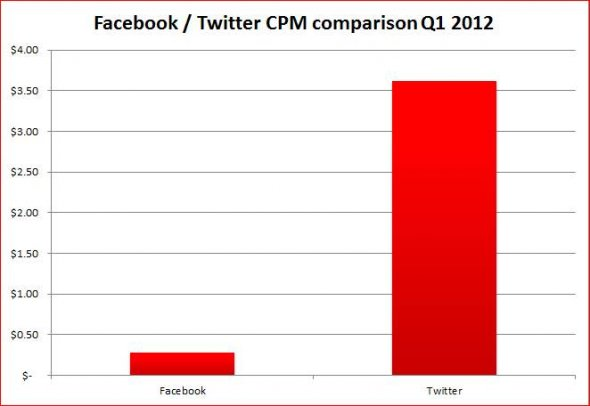
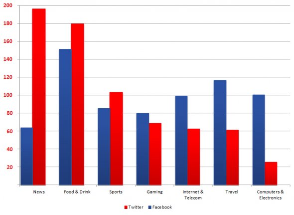
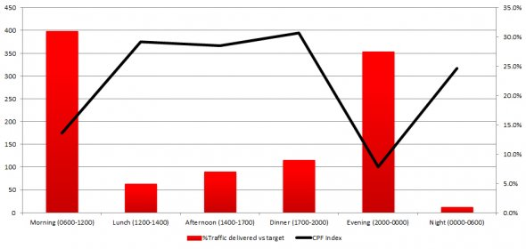

كشفت دراسة نشرتها **TBG Digital** بأن الإعلانات على **تويتر** أغلى من إعلانات **فيس بوك** وأفيد منها بالنسبة للمٌعلنين، رغم حداثة سن الأولى والعدد الهائل لمستخدمي الثانية.

[قارنت](http://www.tbgdigital.com/news/) TBG Digital -والتي تعتبر أكبر بائع لإعلانات فيس بوك، مما يُعطي للدراسة مصداقية أكبر- أداء إعلانات 10 علامات تجارية على الشبكتين خلال الربع الأول من العام الجاري (45 مليار استظهار للإعلانات)، والتي بينت بأن المُعلنين يدفعون ما بين 2.5 و4 دولارات مُقابل كل مُتابع جديد على تويتر، إضافة إلى وصول سعر استظهار ألف مرة للإعلان أو ما يُعرف بالمخصتر CPM إلى 3.5 دولار، في حين لا يتجاوز ذلك على فيس بوك 50 سنتًا.

حسب TBG Digital فإن الاختلاف راجع بشكل أساسي إلى كيفية عرض الإعلانات على كل شبكة، فعلى فيس بوك تظهر الإعلانات على الجهة اليمنى مُنفصلة على المحتوى، وتظهر جلية بأنها إعلانات مما يدفع بالكثيرين إلى تجاهلها، لكن الأمر مختلف على تويتر والذي تستظهر الإعلانات مُباشرة على الخط الزمي Timeline مع باقي التغريدات، مما يجعلها أقرب إلى المُحتوى من كونها "مُجرد إعلانات".

<!-- more -->

كما كشفت الدراسة بأن الإعلانات لها نفع أكثر على تويتر لما يتعلق الأمر بمجالات مُعينة كالأخبار، المأكولات والمشروبات والرياضة، في حين تتفوق فيس بوك لما تكون الإعلانات متعلقة بالألعاب، الإنترنت والاتصالات،  الأسفار والحواسيب ولواحقها.

أما عن الأوقات المُفضّلة للإعلان على كل شبكة فخصلت الدراسة إلى نتيجة مفادها أن الاهتمام يكون مُتزايدا بتويتر في الأوقات التي يكون فيها الاهتمام أكثر بالأخبار، ويتعلق الأمر ببداية اليوم أو خلال الليل، أما فيس بوك فيجلب الاهتمام أكثر في أوقات الغداء والعشاء، مما يرجح من جديد فرضية أن [تويتر للعمل وفيس بوك للراحة](https://socialmedia4arab.com/2010/12/10-differences-facebook-twitter/).

حسب [موقع Business Insider](www.com/twitter-kicked-facebooks-butt-in-q1-advertising-performance-2012-4?op=1) فإن هذا الاختلاف في طريقة عرض الإعلانات على كلتي الشبكتين، وضعف مداخيل الإعلانات "الكلاسيكية" هو ما دفع بفيس بوك إلى بذل الكثير من الجهد لتطوير نوع جديد من الإعلانات، ويتعلق الأمر بـSponsored Stories على كل من نسختي الويب والهواتف من الشبكة.

هل تنقر على إعلانات تويتر أم تتجاهلها؟ وهل تثير إعلانات فيس بوك انتباهك؟
