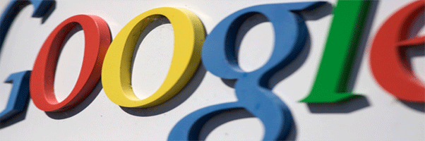

نعود إليكم من جديد مع جلسة جديدة مع Google وأخبارها وسنركز هذه المرة على نقطتين اثنتين: النتائج المالية للشركة، ومشروع النظارات الذكية الذي أسال الكثير من الحبر (أو ضغطات أزرار لوحات المفاتيح) مؤخرا.

## أرباح الربع الأول من عام 2012

[بلغت أرباح Google](http://investor.google.com/earnings/2012/Q1_google_earnings.html) في هذا الرّبع حوالي 10.65 مليار دولار، لتحافظ على مستوى فوق حاجز 10 مليار دولار [لربعين متتاليين ولأوّل مرّة في تاريخها](https://www.it-scoop.com/2012/01/google-news-8/). هذا الرقم يعني زيادة بنسبة 24% مقارنة بالرّبع الأول من عام 2011، وهو ما تعتبر الشركة "فصلاً عظيمًا آخر".

سبق هذا الإعلان [تحديثات أجريت على محرّك البحث](https://www.it-scoop.com/2012/04/google-announces-50-search-changes-march/) وإعلان الشركة بلوغ عدد مستخدمي Google+ حوالي 170 مليونًا و[كشفها عن تحديثات على طبقتها الاجتماعيّة](https://www.it-scoop.com/2012/04/google-plus-new-design/).

	  * مجموع ثروة Google الصافية يقدّر بحوالي 49.3 مليار دولار مع نهاية شهر مارس/آذار.
	  * 54% من أرباح الشركة خلال الرّبع الأوّل أحرزت خارج الولايات المتّحدة.
	  * 27% من أرباح الشّركة خلال الرّبع الأوّل مصدرها مواقع لا تملكها الشّركة بل تتبع لشركات تستعمل خدمات Google.
	  * مع نهاية مارس/آذار أصبح عدد موظّفي الشركة 33077 مقارنة بـ32467 موظّفًا مع نهاية عام 2011.

## نظّارات بتقنيّة الواقع المحسّن (Augmented reality)

الواقع المحسّن مفهوم حديث، ومن تطبيقاته إضافة طبقات على الواقع من خلال التّعرّف على الجمادات المحيطة بالمستقبِل وعرض معلومات عنها. لنقل مثلاً إنّك تستخدم هاتفك المحمول وتشير به إلى كتاب، يتعرّف برنامج الواقع المحسّن على الكتاب ويعرض لك معلومات عنه (نتائج بحث، تاريخ النّشر، محلّات تبيعه... إلخ.)، هذه المعلومات تعرض بشكل طبقة تظهر فوق الكتاب على شاشة الهاتف.

Google سبّاقة دومًا في الاستفادة من المفاهيم الحديثة، وها هي تعرض اليوم مقطع فيديو قصيرًا عن مشروع نظّارات سمّته Project Glass يستغل تقنيّة الواقع المحسّن، شاهد الفيديو:

<!-- more -->

[youtube=http://www.youtube.com/watch?v=9c6W4CCU9M4]

النظارات لم تعد مشروعًا خياليًّا، بل لقد [شوهد Sergey Brin أحد مؤسِّسَي Google يرتدي نموذجًا منها](http://ardroid.com/2012/04/06/google-co-founder-appears-with-augmented-reality-glasses/)، وأكثر من ذلك: [تمكّن مطوّر في جامعة Oxford](http://www.slashgear.com/diy-project-glass-makes-googles-ar-vision-real-10222231/) من صنع نسخة مشابهة وسجّل هذا الفيديو (دون تعديلات كما يقول):

[youtube=http://www.youtube.com/watch?v=33wOKBMA2QA]

لم يسلم هذا المشروع من الرّدود السّاخرة [هنا](http://www.youtube.com/watch?v=t3TAOYXT840) و[هناك](https://www.youtube.com/watch?v=Ma8NbpCvSwo)، وكذلك [طرحت تساؤلات حول فوائده وأخطاره](http://thenextweb.com/google/2012/04/05/5-ways-that-googles-ar-glasses-could-change-our-world)، فماذا لو سُرقت نظّارتي هذه؟ هل سيحصل السّارق على كلّ معلوماتي وأسماء أصدقائي وصوري؟
