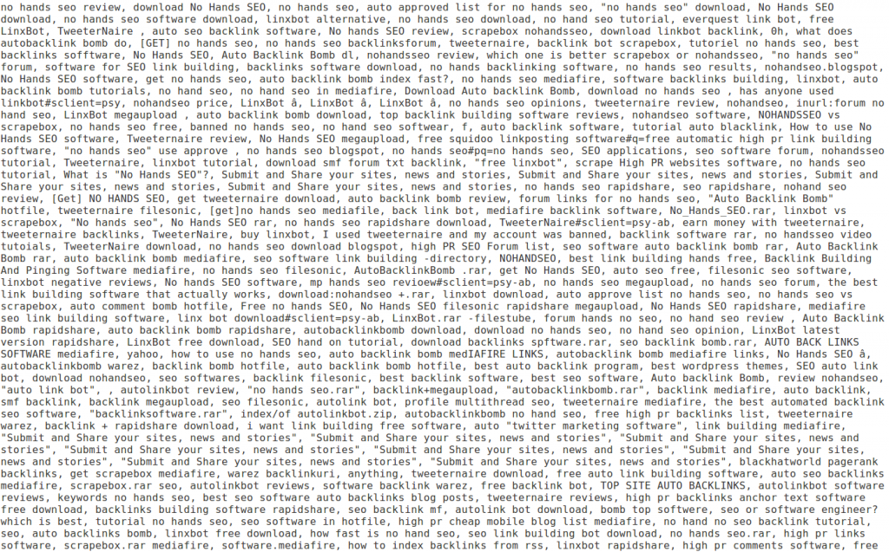

كشفت **Google** عن تحديث جديد على محرك بحثها أطلقت عليه هذه المرة اسم **Google Penguin** والذي يهدف إلى مُحاربة المواقع التي تُفرط (من الإفراط وليس التفريط) في التهيئة لمحركات البحث أو ما يُعرف بمصلح **SEO**، أو تلك التي تستخدم تقنيات "غير مرغوب فيها" والتي تسمى عادة بتقنيات **Black Hat SEO**.

ما هي المواقع المعينة بالأمر؟ إن كنت معنيا بالأمر فستكون على علم بذلك، لأن تحديث Google Penguin سيطال جميع اللغات بما فيها العربية، إما لأنك ستتلقى رسالة على خدمة Google Webmaster، أو أنك ستلاحظ تراجعا في حجم الزيارات القادمة من محركات البحث. ولتوضيح الفكرة حول المواقع المعنية، [تضرب Google مثالين](http://googlewebmastercentral.blogspot.com/2012/04/another-step-to-reward-high-quality.html): الأول يتعلق بموقع يستعمل تقنية حشو الكلمات المفتاحية keyword stuffing، وهي تقنية –مثلما هو ظاهر من اسمها- تسعى إلى استخدام كلمات مفتاحية كثيرة بشكل مركز مثلما توضحه الصورة أدناه (انقر عليها لمشاهدتها بحجمها الكامل):

أما الثاني فيتعلق الأمر بموقع يُسيء استخدام نظام الروابط التشعبية Linking وذلك بإضافة روابط لا تمت للمحتوى الأًصلي بأية صلة مثلما توضحه هذه الصورة:

تُشير Google بأن هذا التحديث (والذي لم تطلق عليه اسم Penguin إلا لاحقا، وذلك بعد أن قام موقع [Searchengine Land](http://searchengineland.com/the-penguin-update-googles-webspam-algorithm-gets-official-name-119623) بعمل استفتاء ووقع اختيار المستَفتين على اسم Titanic) سيمس 12% من عمليات البحث عالميا، لكن سيكون الأمر أقل "ضررًا" على عمليات البحث باللغة الانجليزية (3.1% فقط) أو التي تتم بلغات أخرى كالعربية، الألمانية والصينية، والتي ستتأثر في حدود 3%.

قبل أن تتهم هذا البطريق بتخفيض نسبة زوار موقعك، يُفضل التحقق من الوقت الذي بدأ فيه موقعك بفقد "بريقه" حيث سبق وأن أطلقت Google قُبيل هذا التحديث، تحديث Panda 3.5 يوم 19 أبريل، مثلما أكده [Matt Cutts لموقع Searchengine Land](http://searchengineland.com/winners-losers-from-googles-webspam-update-119493)، حيث ظهرت قائمة على موقع [Searchmetrics](http://blog.searchmetrics.com/us/2012/04/25/google-bad-seo-update-a-first-earthquake-on-the-short-head/) للمواقع التي استفادت والتي لحق بها ضرر جراء تحديث Google Penguin
، قبل أن يتبين أن السبب كان تحديث Panda 3.5، ثم عادة الموقع ليحدث بياناته من جديد.
