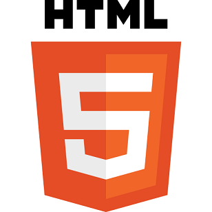

بالرغم من أن الموعد المحدد لوصول **HTML5** إلى إصداره النهائي هو... [2022](http://html5doctor.com/2022-or-when-will-html-5-be-ready/) (وفي رواية [2014](http://www.webmonkey.com/2011/02/html5-will-be-done-in-2014-what-comes-next/))، إلا أن أعمال تطويره أصبحت في مرحلة جد متقدمة، حسبما أعلنت عنه مُنظمة **W3C** في [تدوينة](http://www.w3.org/QA/2012/04/progress_on_html5.html) تعلن فيها أيضا عن التحضير للشروع في تطوير خليفته **HTML6**.

فيما يخص تطوير HTML5 فلقد سبق وأن وصل هذا المعيار إلى مرحلة "[Last Call](http://www.w3.org/2011/02/htmlwg-pr.html.en)"، والتي يُقصد بها وصول HTML5 إلى مرحلة متقدمة وهو حسب تعريف W3C يمثل "دعوة لجميع المجتمعات داخل وخارج W3C  للتأكد من السلامة التقنية للمواصفات"، إلا أن المؤسسة قررت تمرير المعيار إلى Last Call آخر، موازاة مع شروعها في البحث عن مطورين/منتجين آخرين  للعمل وتجربة آخر إصدارات HTML5 و Canavas 2D.

وللقيام بذلك، ستتم إعادة هيكلة الفريق العامل على HTML5 ليتم العمل بشكل متوازٍ على الإصدار القادم له HTML6 والذي لم يطلق عليه أي اسم رسمي بعد، حيث اكتفت W3C بالإشارة إليه بـ " the next version of HTML"  (لا أدري لماذا يذكرني ذلك بحكاية iPad3 و New iPad :p).

واغتنمت المؤسسة الفرصة للتنويه إلى الدعم الذي تتلقاه لغة HTML 5 من طرف الجهات المؤثرة على الويب خاصة دعمه المتقدم والمستمر على المتصفحات الرئيسية، استخدام المواقع الرئيسية له، والاهتمام المتزايد لشركات الألعاب وحتى الشركات التي تقدم محتوى موجها للهواتف بتوفير إصدارات مكتوبة به.

-هل سبق لك وأن برمجت باستخدام HTML5؟ ما الذي تتوقع ظهوره في HTML6؟
